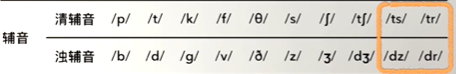
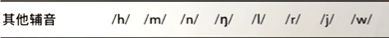

# 辅音音标

## 英语国际音标表

---
## 一：辅音

---
### 1./p/ 与 /b/

??? note "《新概念英语》第一册中涉及到读 **/p/** 的单词"
    **pen**&nbsp;&nbsp;`/pen/` 
    **up**&nbsp;&nbsp;`/ʌp/` 
    **please**&nbsp;&nbsp;`/pliːz/` 

??? note "《新概念英语》第一册中涉及到读 **/b/** 的单词"
    **bag**&nbsp;&nbsp;`/bæɡ/` 
    **book**&nbsp;&nbsp;`/bʊk/` 
    **number**&nbsp;&nbsp;`/ˈnʌmbə(r)/` 

---
### 2./t/ 与 /d/

??? note "《新概念英语》第一册中涉及到读 **/t/** 的单词"
    **it**&nbsp;&nbsp;`/ɪt/` 
    **coat**&nbsp;&nbsp;`/kəʊt/` 
    **suit**&nbsp;&nbsp;`/suːt/` 

??? note "《新概念英语》第一册中涉及到读 **/d/** 的单词"
    **hand**&nbsp;&nbsp;`/hænd/` 
    **good**&nbsp;&nbsp;`/ɡʊd/` 
    **old**&nbsp;&nbsp;`/əʊld/` 

---
### 3./k/ 与 /g/

??? note "《新概念英语》第一册中涉及到读 **/k/** 的单词"
    **book**&nbsp;&nbsp;`/bʊk/` 
    **coat**&nbsp;&nbsp;`/kəʊt/` 
    **car**&nbsp;&nbsp;`/kɑː(r)/` 

??? note "《新概念英语》第一册中涉及到读 **/g/** 的单词"
    **bag**&nbsp;&nbsp;`/bæɡ/` 
    **good**&nbsp;&nbsp;`/ɡʊd/` 
    **dog**&nbsp;&nbsp;`/dɒɡ/` 

---
### 4./f/ 与 /v/

??? note "《新概念英语》第一册中涉及到读 **/f/** 的单词"
    **five**&nbsp;&nbsp;`/faɪv/` 
    **fine**&nbsp;&nbsp;`/faɪn/` 
    **fat**&nbsp;&nbsp;`/fæt/` 

??? note "《新概念英语》第一册中涉及到读 **/v/** 的单词"
    **very**&nbsp;&nbsp;`/ˈveri/` 
    **five**&nbsp;&nbsp;`/faɪv/` 
    **of**&nbsp;&nbsp;`/ɒv/` 

---
### 5./θ/ 与 /ð/

??? note "《新概念英语》第一册中涉及到读 **/θ/** 的单词"
    **thank**&nbsp;&nbsp;`/θæŋk/` 
    **thin**&nbsp;&nbsp;`/θɪn/` 
    **thirsty**&nbsp;&nbsp;`/ˈθɜː.sti/` 

??? note "《新概念英语》第一册中涉及到读 **/ð/** 的单词"
    **this**&nbsp;&nbsp;`/ðɪs/` 
    **that**&nbsp;&nbsp;`/ðæt/` 
    **they**&nbsp;&nbsp;`/ðeɪ/` 

---
### 6./s/ 与 /z/

??? note "《新概念英语》第一册中涉及到读 **/s/** 的单词"
    **dress**&nbsp;&nbsp;`/dres/` 
    **skirt**&nbsp;&nbsp;`/skɜːt/` 
    **house**&nbsp;&nbsp;`/haʊs/` 

??? note "《新概念英语》第一册中涉及到读 **/z/** 的单词"
    **is**&nbsp;&nbsp;`/ɪz/` 
    **please**&nbsp;&nbsp;`/pliːz/` 
    **Chinese**&nbsp;&nbsp;`/tʃaɪˈniːz/` 

---
### 7./s/ 与 /z/

??? note "《新概念英语》第一册中涉及到读 **/s/** 的单词"
    `ps：/s/ = /ʃ/` 
    **shirt**&nbsp;&nbsp;`/ʃɜːt/` 
    **short**&nbsp;&nbsp;`/ʃɔːt/` 
    **ship**&nbsp;&nbsp;`/ʃɪp/` 

??? note "《新概念英语》第一册中涉及到读 **/z/** 的单词"
    `ps：/z/ = /ʒ/` 
    **television**&nbsp;&nbsp;`/ˈtelɪvɪʒn/` 
    **usually**&nbsp;&nbsp;`/ˈjuːʒuəli/` 

---
### 8./tʃ/ 与 /dʒ/

??? note "《新概念英语》第一册中涉及到读 **/tʃ/** 的单词"
    **watch**&nbsp;&nbsp;`/wɒtʃ/` 
    **much**&nbsp;&nbsp;`/mʌtʃ/` 
    **catch**&nbsp;&nbsp;`/kætʃ/` 

??? note "《新概念英语》第一册中涉及到读 **/dʒ/** 的单词"
    **job**&nbsp;&nbsp;`/dʒɒb/` 
    **jump**&nbsp;&nbsp;`/dʒʌmp/` 
    **bridge**&nbsp;&nbsp;`/brɪdʒ/` 

---
## 二：其它辅音

---
### 1./h/

??? note "《新概念英语》第一册中涉及到读 **/h/** 的单词"
    **hand**&nbsp;&nbsp;`/hænd/` 
    **house**&nbsp;&nbsp;`/haʊs/` 
    **here**&nbsp;&nbsp;`/hɪə(r)/` 

---
### 2./r/

??? note "《新概念英语》第一册中涉及到读 **/r/** 的单词"
    **sorry**&nbsp;&nbsp;`/ˈsɒri/` 
    **right**&nbsp;&nbsp;`/raɪt/` 
    **very**&nbsp;&nbsp;`/ˈveri/` 

---
### 3./l/

??? note "《新概念英语》第一册中涉及到读 **/l/** 的单词"
    **well**&nbsp;&nbsp;`/wel/` 
    **tall**&nbsp;&nbsp;`/tɔːl/` 
    **blue**&nbsp;&nbsp;`/bluː/` 

---
### 4./m/

??? note "《新概念英语》第一册中涉及到读 **/m/** 的单词"
    **me**&nbsp;&nbsp;`/miː/` 
    **my**&nbsp;&nbsp;`/maɪ/` 
    **miss**&nbsp;&nbsp;`/mɪs/` 

---
### 5./n/

??? note "《新概念英语》第一册中涉及到读 **/n/** 的单词"
    **pen**&nbsp;&nbsp;`/pen/` 
    **son**&nbsp;&nbsp;`/sʌn/` 
    **nice**&nbsp;&nbsp;`/naɪs/` 

---
### 6./ŋ/

??? note "《新概念英语》第一册中涉及到读 **/ŋ/** 的单词"
    **thanks**&nbsp;&nbsp;`/θæŋks/` 
    **sing**&nbsp;&nbsp;`/sɪŋ/` 
    **song**&nbsp;&nbsp;`/sɒŋ/` 

---
### 7./j/

??? note "《新概念英语》第一册中涉及到读 **/j/** 的单词"
    **yes**&nbsp;&nbsp;`/jes/` 
    **you**&nbsp;&nbsp;`/juː/` 
    **yet**&nbsp;&nbsp;`/jet/` 

---
### 8./w/

??? note "《新概念英语》第一册中涉及到读 **/w/** 的单词"
    **watch**&nbsp;&nbsp;`/wɒtʃ/` 
    **what**&nbsp;&nbsp;`/wɒt/` 
    **one**&nbsp;&nbsp;`/wʌn/` 

---
## 三：疑问

### 1.辅音是什么？

辅音，又叫子音，是指气流在口腔或咽头受到阻碍而形成的音。发音时气流受到发音器官的各种阻碍，声带不一定振动，不够清晰响亮的音素叫辅音。气流从肺里出来不一定振动声带，通过口腔时受到一定的阻碍，这种主要依靠阻碍发出的音叫辅音。

（此结果来自于<a href="https://baike.baidu.com/item/%E8%BE%85%E9%9F%B3" target="_blank">百度百科</a>）

### 2.辅音当中最后的两对为什么没有拿出来讲？

辅音当中的最后两对（即 /ts/ 与 /dz/、/dz/ 与 /dr/）可以近似看成是两个元音直接拼接而成，所以在此不做过多地表述，将会在之后《新概念英语》的课程学习当中逐渐讲解。

### 3.英语当中的清浊辅音如何区分？

通常情况下（英语当中），清浊辅音的区别应该是发音时声带是否震动、是否送气。 

发清辅音时，声带不振动；而发浊辅音时，声带要振动。 

清浊辅音基本成对出现，因此在学习的时候也成对地进行学习。 

### 4./ʃ/ 与 /tʃ/ 在读法上的区别

/ʃ/ 是齿龈后擦音，发音时，**舌尖不上翘，只是舌尖和舌叶上抬**，舌尖可轻轻接触上齿龈，以防卷舌，非常靠近齿龈硬腭区域，气流在舌面和硬腭区域发生摩擦。发 /ʃ/ 时，可以先发 /s/ ，然后舌头向后缩；而普通话中的 /sh/ 是一个卷舌擦音，国际音标符号为[ʂ]，发音时，舌尖上翘，需要向后卷舌。 

/tʃ/ 是龈腭塞擦音，发音时，**舌尖不上翘，只是舌尖和舌叶上抬**，用舌叶抵住齿龈和硬腭的交界处，完全阻塞气流后，再用气流冲破阻碍，这样舌叶和硬腭形成了通气窄道，从而形成摩擦。而汉语拼音 /ch/ 发音时，舌尖上翘，是卷舌音，舌头位置更加靠后。 

（此结果来自于<a href="https://zhuanlan.zhihu.com/p/579981497" target="_blank">互联网</a>）

