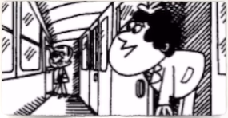
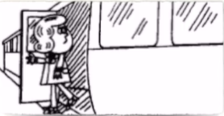
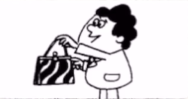

# Lesson 1: Excuse me!（对不起！）

### 一：如何引起他人的注意？

**/ɪk' skju:z/ /mi:/**<br>
<font size=5>**excuse me**</font><br>
①：打扰一下（引起注意）；<br>
>例：<br>
> Excuse me, I think this is yours?（抱歉打扰一下，这个是你的吧？ | すみませんが、これはあなたのですか。）<br>
> Excuse me, everyone?（打扰各位一下 | あのう、すみませんが）

②：借过；让一下
>例：<br>
Excuse me, Let me through.（借过，借过一下 | ちょっと通してくださ～い！）<br>


----
### 二：如何让对方再讲一遍？

**/ˈpɑːdn /**（英），**/ˈpɑːr dn /**（美）<br>
<font size=5>**pardon**</font><br>
①：两种读音，区分英和美式发音的区别之一：是否带儿化音（r）；<br>
②：p /p/，d /d/，n /n/；<br>


在表达“让对方再讲一遍”的时候，除了可以使用“pardon（请谅）”以外，还可以使用以下的短句或词：
>①：sorry?（抱歉 | すみませんが）；<br>
>②：come again?（再说一次？ | もう一度言ってください）；<br>
>③：what?（什么？ | 何？）。


<font size=5>**Thank you very(so) much**</font>

```text
①：th /θ/ 与 /ð/；
②：一般情况下用“Thank you”足矣；
③：thank you /θæŋk/ /(k)juː/；
                 |    ↑
                 └连-读┘
④：连读？弱读？缩读？（连笔字）。
```


----
### 三：当谈单词的时候会谈些什么？

#### ①：单词的**拼写**
> 例：handbag的拼写“h a n d b a g”


#### ②：单词的**发音**

自然拼读法则与音标


#### ③：单词的**词性**

??? note "单词的词性一览表"
    1. 名词 Nouns (n.)，`表示人或事物的名称`；
    2. 代词 pronoun (pron.)，`代替名词、数词、形容词`；
    3. 形容词 adjective (adj.)，`用来修饰名词,表示人或事物的特征`；
    4. 副词 adverb (adv.)，`修饰动、形、副等词,表示动作特征`；
    5. 动词 verb (v.)，`表示动作或状态`；
    6. 数词 numeral (num.)，`表示数目或顺序，用法相当于名词或形容词`；
    7. 介词 preposition (prep.)，`用在名词或代词前,说明它与别的词的关系`；
    8. 连词 conjunction (conj.)，`表示人或事物的名称`；
    9. 冠词 article (art.)，`用在名词前,帮助说明名词所指的范围`；
    10. 感叹词 interjection (int.)，`代替名词、数词、形容词等`。

> 例：handbag n. 中的“n.”表示的该单词的词性为名词

!!! note "为何要学习单词的“词性”呢？"
    同一个单词，不同的词性，会代表截然不同的意思，其在句子当中的成分也会完全不同。<br>
    这些将在接下来的学习中逐渐地感受到的。


#### ④：单词的**含义**
单词含义其实是头脑里的概念，其体现在单词上，就是单词含义所对应的概念。

```text
例：handbag（手提包） --> 用手便可提起来的可盛放东西的器皿
```


#### ⑤：单词的**造句或短语（<font color=red>重点</font>）**
单词往往很少单独出现，一般出现在一段或 n 段句子当中。
> 例：<font color="orange">handbag</font>（手提包）<br>
Is this your <font color="orange">handbag</font>?（这个是你的手提包吗？）

在学习其它语言或母语的时候，经常会用造句子的方式来辅助理解一个或多个单词的含义。
> 例：
> 这个是什么？  --这是一只钢笔。（中）<br>
> What is this?  --This is a pen.（英）<br>
> これは何ですか？  --これはペンです．（日）<br>


因此在学习无论哪一种语言也好，学会通过造句来帮助理解单词的含义是很重要的。


---
### 四：如何询问某件物品是某人的？

<br><font size=4>Excuse me!（打扰一下！ | あのう、すみません！）</font>
<br><br>
<br><font size=4>Yes?（怎么了？ | どうしたですか。）</font>
<br><br>
<br><font size=4>Is this your handbag?（这是你的手提包吗？ | これはあなたのハンドバッグですか？）</font>
<br>


在这里涉及到了学习开始以来的第一条语法：**一般疑问句**


#### 语法：<font color=red>一般疑问句</font>

```text
# 肯定句
This is my handbag.
﹋﹋ ﹋  ﹋ ﹋﹋﹋﹋
 这  是 我的 手提包。
 ﹋  ﹋ ﹋﹋ ﹋﹋﹋
```

如果需要将上面的句子变为一般疑问句，<font color=red>需要将一个单词提前到句子的首位。</font>

> **肯定句**<br>
> This <font style="background-color: yellow; color: #000;" >is</font> my handbag.（这是我的手提包）

> **一般疑问句**<br>
> <font style="background-color: yellow; color: #000;">Is</font> this my handbag?（这是我的手提包吗？）

> 还可以转换为这样<br>
> Is this your handbag?（这是你的手提包吗？）

??? note "练习"
    ```text
    This is my... --> Is this my...（肯定句 --> 一般疑问句）
    
    This is my car. --> Is this your car?
    这是我的车 --> 这是你的车吗？
    これは私の車です。 --> これはあなたの車ですか。
    
    This is my passport. --> Is this your passport?
    这是我的护照。 --> 这是你的护照吗？
    これは私のパスポートです。 --> これはあなたのパスポートですか。
    
    
    This is my pen. --> Is this your pen?
    这是我的钢笔。 --> 这是你的钢笔吗？
    これは私のペンです。 --> これはあなたのペンですか。
    ```

除此之外，“Is this my...?”还可以变为非标准语法的“This my...?”。
> Is this your...?<br>
> =Your..?<br>
> =This your...?<br>
> =This is your...?<br>

既然可以通过变调的方式来改变句子的句式，那为什么还得要学习标准的语法句式呢？

答：随着语法学习的不断深入，学习标准语法句式可在一定程度上减少歧义的发生。


---
### 五：Yes 还能够表示“干什么”？

yes.（是的）<br>
yes? ↑（干什么？/怎么了？）


---
### 六：读英语如何才能不像机器音？

需要进行**跟读**训练。`即：听一句，模仿读一句`

原因：[Ask me if & Comprehension（口语听力练习）](./index.md#3ask-me-if-comprehension)


---

??? note "单词"
    **/ɪk'skju:z/**<br>
    <font size=5>**excuse**</font>&nbsp;&nbsp;<font size=4>`v.原谅`</font><br>
    ①：打扰一下（引起注意）；<br>
    ②：借过；让一下。<br>
    <br>
    **/mi/**<br>
    <font size=5>**me**</font>&nbsp;&nbsp;<font size=4>`pron.我（I 的宾格）`</font><br>
    <br>
    **/'hændbæg/**<br>
    <font size=5>**handbag**</font>&nbsp;&nbsp;<font size=4>`n.手提包`</font><br>
    ①：hand + bag；<br>
    ②：/æ/ 与 /e/ ( yes 的 /jes/ )。<br>
    <br>
    **/ˈpɑːdn/**（英），**/ˈpɑːrdn/**（美）<br>
    <font size=5>**pardon**</font>&nbsp;&nbsp;<font size=4>`int.请再说一遍; 抱歉`</font><br>
    ①：两种读音，区分英和美式发音的区别之一：是否带儿化音（r）；<br>
    ②：p /p/，d /d/，n /n/；<br>
    <br>
    **/ʃi/**<br>
    <font size=5>**she**</font>&nbsp;&nbsp;<font size=4>`pron.她`</font><br>
    <br>
    **/hi , hiː/**<br>
    <font size=5>**he**</font>&nbsp;&nbsp;<font size=4>`pron.他`</font><br>
    <br>
    **/hi , hiː/**<br>
    <font size=5>**it**</font>&nbsp;&nbsp;<font size=4>`pron.它`</font><br>
    <br>
    **/ˈθæŋk juː/**<br>
    <font size=5>**thank you**</font>&nbsp;&nbsp;<font size=4>`pron.谢谢您`</font><br>


??? note "语法"
    <font size=5>**一般疑问句**</font><br>
    如果需要将上面的句子变为一般疑问句，<font color=red>需要将一个单词提前到句子的首位。</font><br>
    **肯定句**<br>
    This <font style="background-color: yellow; color: #000;" >is</font> my handbag.（这是我的手提包）<br>
    **一般疑问句**<br>
    <font style="background-color: yellow; color: #000;">Is</font> this my handbag?（这是我的手提包吗？）