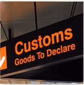
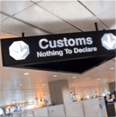

# Lesson 15：Your passports, please.（请出示你们的护照）

## 一：如何识别海关申报通道？

 

①：Goods to declare（需要申报海关的物品） 
②：Nothing to declare（不需要申报海关的物品） 

---
## 二：如何表达英文当中的名词复数？

n. 单数/复数

!!! note "例子"
    friend（单数） - friends（复数） 
    book - books 
    pen - pens 

### 单数变复数的变化规则

1. 直接在词尾加上“-s”，例如“friends、books、pens”等。

!!! note "例子"
    1.pen 
    This is my pen.（这是我的笔）  --->  These <u>are</u> my pens.（这些是我的笔） 
     
    2.book 
    This is my book.（这是我的书）  --->  These <u>are</u> my books.（这些是我的书） 

2. 以字母“s，o，x，ch，sh”结尾的词尾加上“-es”，例如“dresses”等。

3. 有的单词是以“o”结尾的但不一定在词尾加上“-es”，部分是加“-s”，以目前的学习阶段来讲仅先学习以上的两种变化规则。

---
## 三：如何学习英语的语法？

学习语言最重要的是提高语言的复现率（即重复出现的概率）。 

因此在学习的时候，需要尝试不断地地将以前所学到的知识进行复现，以提高复现率。

---
??? note "单词"
    **/ˈkʌstəm/** 
    **customs**&nbsp;&nbsp;`n.海关` 
     
    **/ˈɒfɪsə(r)/** 
    **officer**&nbsp;&nbsp;`n.官员` 
     
    **/bɔɪ/** 
    **boy**&nbsp;&nbsp;`n.男孩，小伙子` 
     
    **/ɡɜːl/** 
    **girl**&nbsp;&nbsp;`n.女孩，姑娘` 
     
    **/ˈdeɪnɪʃ/** 
    **Danish**&nbsp;&nbsp;`n.丹麦语` 
     
    **/frend/** 
    **friend**&nbsp;&nbsp;`n.朋友` 
     
    **/nɔːˈwiːdʒən/** 
    **Norwegian**&nbsp;&nbsp;`n.挪威人; adj.挪威的` 
     
    **/ˈpɑːspɔːt/** 
    **passport**&nbsp;&nbsp;`n.护照` 
     
    **/braʊn/** 
    **brown**&nbsp;&nbsp;`adj.棕色的` 
     
    **/ˈtʊərɪst/** 
    **tourist**&nbsp;&nbsp;`n.旅游者` 

??? note "短语"

??? note "语法练习"
    一：写出下列单词的复数形式 
    例：a girl -- two <u></u> 
     
    ①：a friend -- two <u>friends</u> 
    ②：a passport -- two <u>passports</u> 
    ③：a ticket -- two <u>tickets</u> 
    ④：a student -- two <u>students</u> 
    ⑤：a tourist -- two <u>tourists</u> 
    ⑥：a pencil -- two <u>pencils</u> 
     
    二：仿照例句用所给的信息回答下列问题 
    例①：The books are new. 
    Are the books new? 
    - <u>Yes, they are.</u> 
    例②：The pencils are short. 
    Are the pencils long? 
    - <u>No, they aren't They are short.</u> 
     
    ①：Our doors are white. 
    Are your doors red? 
    - <u>No, they aren't. They are white.</u> 
    ②：These cars are drity. 
    Are these cars clean? 
    - <u>No, they aren't. They are drity.</u> 
    ③：Our friends are Norwegian. 
    Are your friends Norwegian? 
    - <u>Yes, they are.</u> 
     
    三：使用“am、is”或者“are”来进行填空 
    例：<u>Is</u> your girl friend fat or thin? 
     
    ①：Our house <u>is</u> big and clean. 
    ②：<u>Are</u> you an engineer or a taxi driver? 
    ③：<u>Are</u> these your pens? What make <u>are</u> they? 

