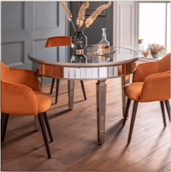

# Lessson 23：Which glasses?（哪几只杯子？）


## 一：Where 引导的特殊疑问句？

<font size=4 color=red>**特殊疑问句 = 特殊疑问词（如：what、how、whose、whowhere、where等） + 一般疑问句（去掉答案）**</font>

> 例：<br>
> My book is on the shelf.<br>
> <font color=orange>Is</font> my book on the shelf?（一般疑问句）<br>

```text
一般疑问句 --> 特殊疑问句

 ┌----------------------------------┐
 ↓                                  |
     Is my book (on the shelf --> where)?

Where is my book?（你的书在哪里？ | 君の本はどこに置きましたか？）

```


??? note "练习"
    <br>
    1. desk<br>
    The books are on the desk.<br>
    Are the books <font style="background-color: orange" color=black>on the desk</font>?（一般疑问句）<br>
    <font style="background-color: orange" color=black>Where</font> are the books?（特殊疑问句[Where]）<br>
    <br>
    <br>
    2. table<br>
    The bottle is on the table.<br>
    Is the bottle <font style="background-color: orange" color=black>on the table</font>?（一般疑问句）<br>
    <font style="background-color: orange" color=black>Where</font> is the bottle?（特殊疑问句[Where]）<br>
    <br>
    <br>
    3. plate<br>
    The plates are on the table.<br>
    Are the plates <font style="background-color: orange" color=black>on the table</font>.（一般疑问句）<br>
    <font style="background-color: orange" color=black>Where</font> are the plates?（特殊疑问句[Where]）<br>
    <br>


---
## 二：如何表达“笔在桌子上”？

The pen <font color=orange>on the desk</font>.（笔<font color=orange>在桌子上</font>[表示地点]。）


---
## 三：you/we/they 的宾格？

可回顾[第二十一章的内容](./Lesson-21.md#give-sb-sth)，之前便讲解并练习了“give sb. sth.（给 某人 某物）”，在这里主要对“sb.（某人）”进行扩展。

| 动词前sb. | 动词后sb.|
|   :-:    |   :-:   |
| you（你） | you（你）|
|  we（我） |  <font color=orange>us（我）</font>|
|they（他们）|<font color=orange>them（他们）</font>|

??? note "练习"
    <br>
    1. food<br>
    give you/us/them some food. Please!!（请给 他/我/他们 食物。）<br>
    <br>
    <br>
    2. water<br>
    give you/us/them some water. Please!!（请给 他/我/他们 水。）<br>
    <br>


---
??? note "单词"
    **/ɒn/**<br>
    <font size=5>**on**</font>&nbsp;&nbsp;<font size=4>`prep.在...之上`</font><br>
    <br>
    **/ʃelf/**<br>
    <font size=5>**shelf**</font>&nbsp;&nbsp;<font size=4>`n.架子，搁板`</font><br>
    <br>


??? note "短语"
    <font size=5>**Table for (number).**</font>&nbsp;&nbsp;<font size=4>`几人桌（在订餐的时候）`</font><br>
    补充：I want a table for (nummber).（我想要一张几人的桌子。 | (人数)人掛けのテーブルをお願いします。）
    <br>


??? note "语法练习"
    ```text
    1. 使用“ one ” 或“ ones ”填空。
    例：Are these your books? The *ones* on the shelf?

    ①：Give me two cups. please.
      -- Which *ones*?
      -- The *ones* on the table.
    ②：Which is your chair?
      -- The *one* in your room.
    ③：Give me that tie, please.
      -- The orange one.
    ④：Which car is your father's?
      -- The German *one* or the Japanese *one*?

    
    2. 仿照例句写出下列各句的对应句
    例：
    ①：Here's a small box.(big)  -- *This one isn't small. It's a big one.*
    ②：Here are some blue shoes.(grey)  -- *These aren't blue. They're grey.*

    ①：Here's an old coat.(new)  -- *This one isn't old.  It's a new one.*
    ②：Here's a small shirt.(large)
      -- *This one isn't small. It's a large one.*
    ③：Here are some yellow dresses.(green)  -- *These  aren't yellow. They're green.*
    ```

