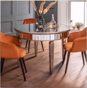
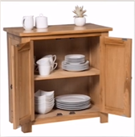
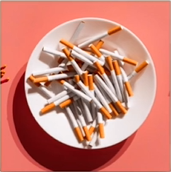
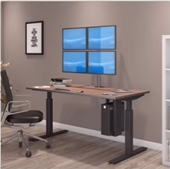
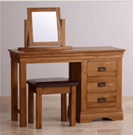
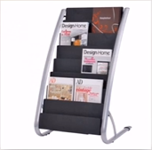
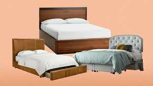
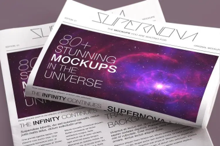
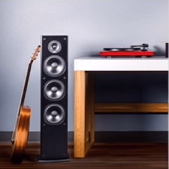

# Lesson 24：Give me/him/her/us/them some ...（给 我/他/我们/他们 一些） Which ones?（哪些？）

!!! note "练习"
     
    **1. desk** 
    ①：The pens are on the desk.（一些钢笔在书桌上。） 
    ②：Are the pens on the desk?（有一些钢笔在书桌上吗？） 
    ③：Where are the pens?（一些钢笔在哪里呀？） 
    ④：Give me some pens, please.（请给我一些钢笔。） 
    -- Whitch ones?（要哪些的？） 
    -- The ones on the desk.（要放在书桌上的那些。） 
     
     
    **2. table** 
    ①：The plates are on the table.（一些碟子在桌子上。） 
    ②：Are the plates on the desk?（有一些碟子在桌子上吗？） 
    ③：Where are the plates?（一些碟子在哪里呀？） 
    ④：Give him some plates, please.（请给他们一些碟子。） 
    -- Whitch ones?（要哪些的？） 
    -- The ones on the desk.（要放在桌子上的那些。） 
     
     
    **3. plate** 
    ①：The plates are on the cupboard.（一些碟子在食橱上。） 
    ②：Are the plates on the cupboard?（有一些碟子在食橱上吗？） 
    ③：Where are the plates?（一些碟子在哪里呀？） 
    ④：Give her some plates, please.（请给她们一些碟子。） 
    -- Whitch ones?（要哪些的？） 
    -- The ones on the cupboard.（要放在食橱上的那些。） 
     
     
    **4. cupboard** 
    ①：The plates are on the cupboard.（一些碟子在食橱上。） 
    ②：Are the plates on the cupboard?（有一些碟子在食橱上吗？） 
    ③：Where are the plates?（一些碟子在哪里呀？） 
    ④：Give her some plates, please.（请给她们一些碟子。） 
    -- Whitch ones?（要哪些的？） 
    -- The ones on the cupboard.（要放在食橱上的那些。） 
     
     
    **5. cigarette** 
    ①：The cigarettes are on the plate.（一些香烟在盘子上。） 
    ②：Are the cigarettes on the plate?（有一些香烟在盘子上吗？） 
    ③：Where are the cigarettes?（一些香烟在哪里呀？） 
    ④：Give them some cigarettes, please.（请给他们一些香烟。） 
    -- Whitch ones?（要哪些的？） 
    -- The ones on the plate.（要放在盘子上的那些。） 
     
     
    **6. television / TV** 
    ①：The television is on the table.（电视机在桌子上。） 
    ②：Is the television on the plate?（电视机在桌子上吗？） 
    ③：Where is the television?（电视机在哪里呀？） 
     
     
    **7. floor** 
    ①：The woman is on the floor.（女人在地板上。） 
    ②：Is the woman on the floor?（女人在地板上吗？） 
    ③：Where is the woman?（女人在哪里呀？） 
     
     
    **8. dressing table** 
    ①：The dressing table is on the floor.（梳妆台在地板上。） 
    ②：Is the dressing table on the floor?（梳妆台在地板上吗？） 
    ③：Where is the dressing table?（梳妆台在哪里呀？） 
     
     
    **9. magazine** 
    ①：The magazines are on the shelf.（一些杂志在架子上。） 
    ②：Are the magazine on the shelf?（有一些杂志在架子上吗？） 
    ③：Where are the magazine?（那些杂志在哪里呀？） 
    ④：Give me some magazines, please.（请给我一些杂志。） 
    -- Which ones?（要哪一些的？） 
    -- The ones on the shelf.（就放在架子上的那些。） 
     
     
    **10. bed** 
    ①：They are on the bed.（他们在床上。） 
    ②：Are they on the bed?（他们在床上吗？） 
    ③：Where are they?（他们在哪里呀？） 
     
     
    **11. newspaper** 
    ①：The newspapers are on the floor.（这些杂志在地板上。） 
    ②：Are the newspapers on the floor?（这些杂志是在地板上吗？） 
    ③：Where are the newspapers?（这些杂志在哪里？） 
    ④：Give me some newspapers, please.（请给我一些杂志。） 
    -- Which ones?（要哪一些呢？） 
    -- The ones on the floor.（就地板上的那些。） 
     
     
    **12. stereo** 
    ①：The stereo is on the floor.（这台立体声音响放在地板上。） 
    ②：Is the stereo on the floor?（这台立体声音响是放在地板上的吗？） 
    ③：Where is the stereo?（这台立体声音响是放在哪里的？） 
     

---
??? note "单词"
    **/desk/** 
    **desk**&nbsp;&nbsp;`n.书桌` 
     
    **/ˈteɪbl/** 
    **table**&nbsp;&nbsp;`n.桌子 ` 
     
    **/pleɪt/** 
    **plate**&nbsp;&nbsp;`n.盘子` 
     
    **/ˈkʌbəd/** 
    **cupboard**&nbsp;&nbsp;`n.食橱` 
     
    **/ˌsɪɡəˈret/** 
    **cigarette**&nbsp;&nbsp;`n.香烟` 
     
    **/ˈtelɪvɪʒn/** 
    **television**&nbsp;&nbsp;`n电视机` 
    补充：TV（/ˌtiːˈviː/，电视（机）（television的缩写）） 
     
    **/flɔː(r)/** 
    **floor**&nbsp;&nbsp;`n.地板` 
     
    **/ˈdresɪŋ teɪbl/** 
    **dressing table**&nbsp;&nbsp;`n.梳妆台` 
     
    **/ˌmæɡəˈziːn/** 
    **magazine**&nbsp;&nbsp;`n.杂志` 
     
    **/bed/** 
    **bed**&nbsp;&nbsp;`n.床` 
     
    **/ˈnjuːzˌpeɪ.pə(r)/** 
    **newspaper**&nbsp;&nbsp;`n.报纸` 
     
    **/ˈsteriəʊ/** 
    **stereo**&nbsp;&nbsp;`n.立体声; 立体声音响` 
     

??? note "语法练习"

