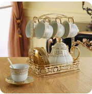
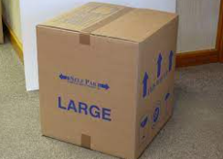
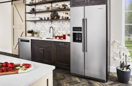

# Lesson 26：Where is it?（它在哪里？）

!!! note "练习"
     
    1. clean cup 
    ①：There are some clean cups on the desk.（桌子上放着一些干净的杯子。 | テーブルの上に綺麗なグラスがあります。） 
    ②：Are there some clean cups on the desk?（桌子上有摆放一些干净的杯子吗？ | テーブルの上に綺麗なグラスがありますか？） 
    ③：Where are the clean cups?（干净的杯子们在哪里？ | きれいなカップはどこにあるか？） 
    ④：There are not any clean cups on the desk.（桌子上并没有一些干净的杯子。 | テーブルの上に綺麗なグラスがありません。） 
     
     
    2. large box 
    ①：There is a large box on the floor.（地板上放着一个大箱子。 | 床に大きな箱があります。） 
    ②：Is there a large box on the floor?（地板上放着一个大箱子吗？ | 床に大きな箱がありますか？） 
    ③：Where are the large box?（大箱子放在哪里了？ | 大きな箱はどこにありますか？） 
    ④：There are not a large box on the floor.（地板上没有放着一个大箱子。 | 床に大きな箱がありません。） 
     
     
    2. refrigerator 
    ①：There is a refrigerator in the kitchen.（厨房里放着一台冰箱。 | キッチンには冷蔵庫があります。） 
    ②：Is there a refrigerator in the kitchen?（厨房里放着一台冰箱吗？ | キッチンには冷蔵庫がありますか？） 
    ③：Where is the refrigerator?（冰箱放在哪里了？ | 冷蔵庫はどこにありますか？） 
    ④：There are not a refrigerator in the kitchen.（厨房里没有放着一台冰箱。 | キッチンには冷蔵庫がありません。） 

---
??? note "单词"
    **/weə/** 
    **where**&nbsp;&nbsp;`adv.在哪里` 
     
    **/ɪn/** 
    **in**&nbsp;&nbsp;`prep.在...的里面` 
     

