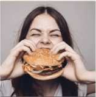
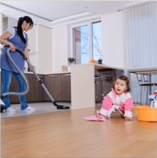

# Lesson 32：What's he/she/it doing?（他/她/它 正在做什么呢？）

!!! note "练习"
     
    1. type（打字） 
    ①：What are they doing?（他们正在做些什么？） 
    ②：Are they making the table?（他们正在清理桌面吗？） 
    ③：No, They are taping.（不，他们在打字。）  
     
    2. letter（信） 
    ①：What’s she doing?（她正在做些什么？） 
    ②：Is she reading a book?（她正在阅读书籍吗？） 
    ③：No, She's typing a letter.（不，她正在打一封信。）  
     
    3. basket（篮子） 
    ①：This is an empty basket.（这是一个空篮子） 
    ②：Whose empty basket is this?（这个空篮子是谁的？）  
     
    4. eat（吃） 
    ①：What’s she doing?（她正在做些什么？） 
    ②：Is she drinking a water?（她正在喝水吗？） 
    ③：No, She's eating a hamburger.（不，她正在吃汉堡。）  
     
    5. bone（骨头） 
    ①：What’s it doing?（它正在做些什么？） 
    ②：Is it drinking a water?（它正在喝水吗？） 
    ③：No, It's eating a bone.（不，它正在咬骨头。）  
     
    6. clear（清洁） 
    ①：What are they doing?（他们正在做些什么？） 
    ②：Are they playing?（他们正在玩耍吗？） 
    ③：No, They are cleaning the floor.（不，他们在打扫地板。）  

---
??? note "单词"
    **/taɪp/** 
    **type**&nbsp;&nbsp;`v.打字` 
     
    **/ˈletə/** 
    **letter**&nbsp;&nbsp;`n.信` 
     
    **/ˈbɑːskɪt/** 
    **basket**&nbsp;&nbsp;`n.篮子` 
     
    **/iːt/** 
    **eat**&nbsp;&nbsp;`v.吃` 
     
    **/bəʊn/** 
    **bone**&nbsp;&nbsp;`n.骨头` 
     
    **/kliːn/** 
    **clean**&nbsp;&nbsp;`v.清洁` 
     
    **/tuːθ/** 
    **tooth**&nbsp;&nbsp;`n.牙齿` 
    补充：teeth（/tiːθ/，n.牙齿[复数形式]） 
     
    **/kʊk/** 
    **cook**&nbsp;&nbsp;`v.做（饭菜）` 
     
    **/mɪlk/** 
    **milk**&nbsp;&nbsp;`n.牛奶` 
     
    **/miːl/** 
    **meal**&nbsp;&nbsp;`n.饭，一顿饭` 
     
    **/drɪŋk/** 
    **drink**&nbsp;&nbsp;`v.喝` 
     
    **/tæp/** 
    **tap**&nbsp;&nbsp;`n.（水）龙头` 
     

