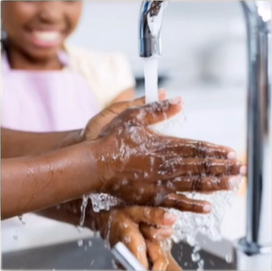

# Lesson 34：What are they doing?（他们在做些什么？）

!!! note "练习"
     
    1. sleep - sleeping 
    ①：What's the baby doing?（那个婴儿在做什么呢？） 
    ②：The baby's sleeping with his father.（他正在和他的爸爸一起睡觉。） 
     
     
    2. wash - washing 
    ①：What's the girl doing?（那个女孩的在做什么呢？） 
    ②：The girl's washing hands with her mom.（她正在和她妈妈一起洗手。） 
     
    3. wait - waiting 
    ①：What are they doing?（那个人在做什么呢？） 
    ②：They're waiting for a bus.（他们正在等待公交车。） 

---
??? note "单词"
    **/sliːp/** 
    **sleep**&nbsp;&nbsp;`v.睡觉` 
     
    **/ʃeɪv/** 
    **shave**&nbsp;&nbsp;`v.刮（胡子）` 
     
    **/kraɪ/** 
    **cry**&nbsp;&nbsp;`v.哭，喊` 
     
    **/wɒʃ/** 
    **wash**&nbsp;&nbsp;`v.洗` 
     
    **/weɪt/** 
    **wait**&nbsp;&nbsp;`v.等` 
     
    **/dʒʌmp/** 
    **jump**&nbsp;&nbsp;`v.跳` 
     

??? note "语法练习"
    一：仿照例句使用所给的单词回答问题 
    例：What are you looking at?（we/the boats） 
    <u>We're looking at the boats.</u> 
    Where are the boats?（on the river） 
    <u>They are on the river.</u> 
     
    ①：What are Linda and her sister waiting for?（they/the bus） 
    <u>They're waiting for the bus.</u> 
    Where are they waiting?（at the bus stop） 
    <u>They're at the bus stop.</u> 
    ②：What are the dogs eating?（they/bones） 
    <u>They're eating bones.</u> 
    Where are they ating the bones?（in the garden） 
    <u>They're in the garden.</u> 
    ③：What are you doing?（we/wait for the next class） 
    <u>We're waiting for the next class.</u> 
    Who is your teacher?（Miss Scott） 
    <u>Miss Scott is our teacher.</u> 
    ④：What are the babies doing?（they/sleep） 
    <u>They're sleeping.</u> 
    Where are they sleeping?（in their bedroom） 
    <u>They're in their bedroom.</u> 
     
    二：写出下列动词的“-ing”形式 
    <table border=4>
        <tr>
            <td>原型</td>
            <td>-ing 形式</td>
            <td>原型</td>
            <td>-ing 形式</td>
        </tr>
        <tr>
            <td>turn</td>
            <td title="turning"></td>
            <td>shine</td>
            <td title="shining"></td>
        </tr>
        <tr>
            <td>run</td>
            <td title="running"></td>
            <td>take</td>
            <td title="taking"></td>
        </tr>
        <tr>
            <td>make</td>
            <td title="making"></td>
            <td>walk</td>
            <td title="walking"></td>
        </tr>
        <tr>
            <td>type</td>
            <td title="typing"></td>
            <td>fly</td>
            <td title="flying"></td>
        </tr>
        <tr>
            <td>put</td>
            <td title="putting"></td>
            <td>empty</td>
            <td title="emptying"></td>
        </tr>
        <tr>
            <td>dust</td>
            <td title="dusting"></td>
            <td>cry</td>
            <td title="crying"></td>
        </tr>
        <tr>
            <td>shave</td>
            <td title="shaving"></td>
            <td>shut</td>
            <td title="shuting"></td>
        </tr>
    </table>

