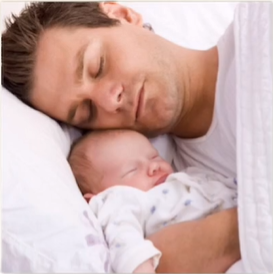
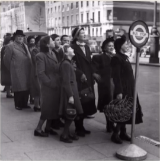

# Lesson 34：What are they doing?（他们在做些什么？）

!!! note "练习"
     
    1. sleep - sleeping 
    ①：What's the baby doing?（那个婴儿在做什么呢？） 
    ②：The baby's sleeping with his father.（他正在和他的爸爸一起睡觉。） 
     
     
    2. wash - washing 
    ①：What's the girl doing?（那个女孩的在做什么呢？） 
    ②：The girl's washing hands with her mom.（她正在和她妈妈一起洗手。） 
     
    3. wait - waiting 
    ①：What are they doing?（那个人在做什么呢？） 
    ②：They're waiting for a bus.（他们正在等待公交车。） 

---
??? note "单词"
    **/sliːp/** 
    **sleep**&nbsp;&nbsp;`v.睡觉` 
     
    **/ʃeɪv/** 
    **shave**&nbsp;&nbsp;`v.刮（胡子）` 
     
    **/kraɪ/** 
    **cry**&nbsp;&nbsp;`v.哭，喊` 
     
    **/wɒʃ/** 
    **wash**&nbsp;&nbsp;`v.洗` 
     
    **/weɪt/** 
    **wait**&nbsp;&nbsp;`v.等` 
     
    **/dʒʌmp/** 
    **jump**&nbsp;&nbsp;`v.跳` 
     

??? note "语法练习"

