# Lesson 35：Our village（我们的村庄）

## 一：如何表达“再给我一个月”？

Give him another month.（再给我一个月 | もう一ヶ月）

---
## 二：如何使用“prep.（介词）”

### 1.between（在...之间）

??? note "例子"
     
    The baby is sleeping between his parents. 
    （这个婴儿正睡在父母之间。 | この赤ん坊は今両親の間で寝ています。）

### 2. into（从外面进入到里面）
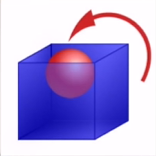

??? note "例子"
     
    What's she doing?  -- She's walking into a shop. 
    （她正在干什么？  -- 她正在走进一家商店。 | 彼女は何をしている？ -- 今店に入っています。）

### 3. out of（从里面出到外面）
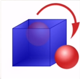

??? note "例子"
     
    What are the children doing?  -- The children are running out of school. 
    （孩子们在做什么？  -- 他们在跑着离开学校。 | 子供達はは何をしている？ -- 彼らは今走って学校から出る。）

### 4. along（沿着...）

??? note "例子"
    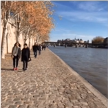 
    What are they doing?  -- They're walking along the river. 
    （他们在干什么？ -- 他们在沿着河岸行走。 | 彼らは何をしているんですか？ -- 川を沿って歩いています。）

### 5. across（穿过...）

??? note "例子"
     
    What are they doing?  -- They're swimming acorss the river. 
    （它们在干什么？ -- 它们在穿过这条河。 | あれらの動物は何をしているのですか？ -- 川を渡っています。）

### 6. beside（紧挨着/靠近...）
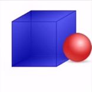

??? note "例子"
     
    The left man's sitting beside the woman. 
    （左边的那位男士坐在紧挨着那位女士的一边。 | 左側の男性は女性の隣に座っています。）

### 7. near（在...的旁边）
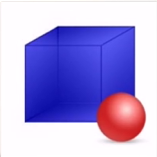

??? note "例子"
     
    The right man's sitting near the woman. 
    （右边的那位男士坐在那位女士的旁边。 | 右側の男性は女性の傍に座っています。） 
     
    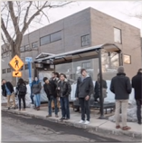 
    Where are they?  -- They're near the building. 
    （他们在哪里？ -- 他们在建筑物的附近。 | 彼らはどこにいるんですか？ -- 建物の近くにいます。）

### 8. under（在...的下面）
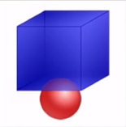

??? note "例子"
     
    What is the ship doing?  -- The ship is going under the bridge. 
    （那艘轮船在做什么？ -- 那艘轮船正在桥下行驶。 | あの船は何をしているのですか？ -- 船が橋の下を航行しています。）

### 9. over（在...的上面）
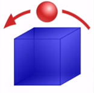

??? note "例子"
     
    What are the planes doing?  -- They're flying over the bridge. 
    （那群飞机在做什么？ -- 它们正飞在桥的上方。 | それらの飛行機は何をしているのですか？ -- それらの飛行機は橋の上を飛んでいます。）

### 10. in（在...的里面）
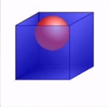

??? note "例子"
     
    What's she doing?  -- She's sitting on the floor. 
    （她正在做什么？ -- 她正坐在地板上。 | 彼女は今何をしているんですか？ -- 彼女は今床に座っています。）

### 11. on（在...的上面）
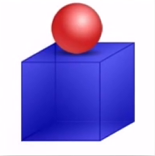

??? note "例子"
     
    What are your grandparents doing?  -- They're sitting in the park. 
    （你的爷爷奶奶在做什么？ -- 他们坐在公园里。 | 君の祖父母は何をしていますか？ -- 彼らは公園に座っています。）

### 12. off（从...[高处]下来）
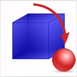

??? note "例子"
     
    What are they doing?  -- They're jumping off the wall. 
    （他们正在做什么？ -- 他们正在跳离这道墙。 | 彼らは何をしていますか -- 彼らは壁から飛び降りています。）

### 13. onto（从...[低处]上去）
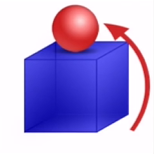

??? note "例子"
    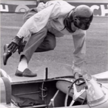 
    What's he doing?  -- He's jumping onto his car. 
    （他在做什么？ -- 他正在跳到他的车上。 | 彼は何をしているの？ -- 彼は自分の車に飛び乗っています。）

---
## 三：如何避免遗忘之前学过的内容？

那就是“ **总结** + **造句** ”

首先需要先将书本上的知识**总结**到笔记本上以供随时翻阅，这也是一种主动听课的最好方式之一；

其次学习到的单词、语法和习惯用法等的目的便是为了服务于**造句**。

将之前所学到的单词、语法和习惯用法等重复用在新学习的单词、语法和习惯用法等当中，可谓是一种可避免遗忘之前所学到内容的方式。

---
## 四：“on”的特殊用法之一：表旁边/附近（near）

当“on”的后方接着一个表江、河、湖、海相关单词的时候，此时的“on”表的是“某个东西在江、河、湖、海的旁边/附近（near）”。

> 例： 
> The village is on a river.（村庄建设在河的旁边） 

---
??? note "单词"
    **/ˈfəʊtəɡrɑːf/** 
    **photograph**&nbsp;&nbsp;`n.照片` 
     
    **/ˈvɪlɪdʒ/** 
    **village**&nbsp;&nbsp;`n.村庄` 
     
    **/ˈvæli/** 
    **valley**&nbsp;&nbsp;`n.山谷` 
     
    **/bɪˈtwiːn/** 
    **between**&nbsp;&nbsp;`prep.在...的之间` 
     
    **/hɪl/** 
    **hill**&nbsp;&nbsp;`n.小山` 
     
    **/əˈnʌðə/** 
    **another**&nbsp;&nbsp;`det.另一个` 
     
    **/waɪf/** 
    **wife**&nbsp;&nbsp;`n.妻子` 
    补充：husband（/ˈhʌzbənd/，n.丈夫） 
     
    **/əˈlɒŋ/** 
    **along**&nbsp;&nbsp;`prep.沿着` 
     
    **/bæŋk/** 
    **bank**&nbsp;&nbsp;`n.河岸` 
    补充：along the banks of the river.（沿着河的两岸） 
     
    **/ˈwɔːtə/** 
    **water**&nbsp;&nbsp;`n.水` 
     
    **/swɪm/** 
    **swim**&nbsp;&nbsp;`v.游泳` 
     
    **/ˈbɪldɪŋ/** 
    **building**&nbsp;&nbsp;`n.大楼` 
     
    **/pɑːk/** 
    **park**&nbsp;&nbsp;`n.公园` 
     
    **/ˈɪntu/** 
    **into**&nbsp;&nbsp;`prep.进入` 
     

??? note "语法练习"

