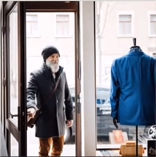
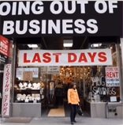
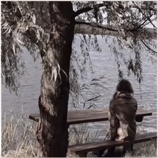

# Lesson 36：Where ...?（...在哪里？）

!!! note "练习"
    be(am/is/are) + v.ing + 介词 
     
     
    1. into the shop 
    ①：Where's the man going? 
    ②：He's going into the shop. 
     
     
    2. out of the shop 
    ①：Where's the she doing? 
    ②：She's going out of the shop. 
     
     
    3. walking acroos the street 
    ①：Where are the man and the woman walking? 
    ②：They're walking acroos the street.
     
     
    4. jumping off the wall 
    ①：Where are the children jumping? 
    ②：They're jumping off the wall. 
     
     
    5. sitting near the tree 
    ①：Where's the girl sitting? 
    ②：She's sitting near the tree. 
     
     
    6. over the bridge 
    ①：Where's the plane flying? 
    ②：It's flying over the bridge. 

---
??? note "单词"
    **/bɪˈsaɪd/** 
    **beside**&nbsp;&nbsp;`prep.在...的旁边` 
     
    **/ɒf/** 
    **off**&nbsp;&nbsp;`prep.离开` 
     

??? note "语法练习"
    一：使用“some、any”来进行填空 
    例：There are old men in the park. <u>Some</u> are standing under trees; <u>some</u> are sitting on chairs. 
     
    ①：Do you know <u>any</u> people here? 
    ②：English people speak English, but <u>some</u> speak French. 
    ③：There isn't <u>any</u> cheese left in the fridge. 
    ④：<u>Some</u> birds are flying over the bridge. 
    ⑤：There aren't <u>any</u> villages in that valley. 
    ⑥：Are there <u>any</u> children in the park? 
     
    二：使用“beside、between、on、along、out of”来进行填空 
    ①：Come and sit down <u>beside</u> me under the tree. 
    ②：Our village is in a valley <u>between</u> two big hills. 
    ③：His small house is <u>between</u> Mr. Smith's and Mrs. White's. 
    ④：They're wwalking <u>along</u> the street in the village. 
    ⑤：Mrs. Green is coming <u>out of</u> thhe shop with a loaf of bread. 
    ⑥：Where's my blue pen? 
    - It's <u>on</u> your desk <u>between</u> that red book and those letters. 
    - And where's my red pencil? 
    - It's <u>beside</u> your computer. 
    - And where are those new photographs? 
    - They're <u>on</u> your bed. 

