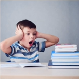
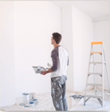

# Lesson 38：What are you going todo?（你准备做什么？） 　　　　　&nbsp;&nbsp;&nbsp;What are you doing now?（你现在正准备做什么？）

!!! note "练习"
     
    1. homework 
    ①：What's he doing?（他正在做什么？ | その男は今何しているのですか？） 
    ②：He's looking at his homework.（他正在看自己的家庭作业。 | その男は今自分の宿題を見ています。） 
    ③：What's he going to do?（他要去做什么呢？ | その男は何をするつもりですか？） 
    ④：He's going to do his homework.（他要去做他的家庭作业 | その男は宿題をするつもりです。） 
     
     
    2. listen to 
    ①：What's he doing?（他正在做什么？ | 彼は何をしているのですか？） 
    ②：He's turning on the stereo.（他正在打开音响。 | 彼はステレオをつけています。） 
    ③：What's he going to do?（他要去做什么呢？ | 彼は何をするつもりですか？） 
    ④：He's going to listen to music.（他要去听音乐。 | 彼は音楽を聴くつもりです。） 
     
     
    3. walk - walk for 
    ①：What are they doing?（他们正在做什么？ | 彼らは今何してるのですか？） 
    ②：They're walking to the bus stop.（他们正在走向公交车站。 | 彼らはバス停に向かって歩いています。） 
    ③：What are they going todo?（他们要去做什么呢？ | 彼らは何をするつもりですか？） 
    ④：They're going to wait for a bus.（他们在等待公交车。 | 彼らはバスを待つつもりです。） 
     
     
    4. paint 
    ①：What's he going?（他正在做什么？ | 彼は何をしているのですか？） 
    ②：He's looking at the wall.（他正在看着这面墙壁。 | 彼はその壁を見ています。） 
    ③：What's he going to do?（他要去做什么呢？ | 彼は何をするつもりですか？） 
    ④：He's going to paint this wall.（他要粉刷这面墙。 | 彼は壁を塗るつもりです。） 

---
??? note "单词"
    **/ˈhəʊmwɜːk/** 
    **homework**&nbsp;&nbsp;`n.作业` 
     
    **/ˈlɪsn/** 
    **listen**&nbsp;&nbsp;`v.听` 
     
    **/dɪʃ/** 
    **dish**&nbsp;&nbsp;`n.盘子，碟子` 
    补充：dish - dishes[复数形式]（很多个盘子/碟子。也可以用来表示等待被洗涤的锅碗瓢盆等） 
     

??? note "语法练习"
    一：仿照例句用所给的词回答问题 
    例： 
    What are you doing to do?（I / drink water） 
    - I'm going to drink water. 
     
    ①：What are you doing to do?（we / wait for the bus） 
    - We're goiing to wait for the bus. 
    ②：What are you going to do?（I / read a magazine） 
    - I'm going to read a magazine. 
    ③：What are you going to do?（we / paint our doors） 
    - We're going to paint our doors. 
    ④：What are you going to do?（I / cook bread for my son） 
    - I'm goinng to cook bread for my son. 
    ⑤：What are you doing to do?（I / do mmy homework） 
    - I'm going to do my homework. 
     
     
    二：仿照例句回答问题 
    例： 
    ①：Are you working now? 
    - No, I'm not, and I'm not going to work. 
    ②：This window is dirrty.（I / clean） 
    - I'm going to clean it now. 
     
    ①：Are you doing your homework now? 
    - No, I'm not, and I'm not going to do my homework. 
    ②：Are you cleaning your shoes now? 
    - No, I'm not, and I'm not going to clean my shoes. 
    ③：Are you putting on your tie now? 
    - No, I'm not, and I'm not going to put on my tie. 
    ⑤：Are you cooking now? 
    - No, I'm not, and I'm not going to cook. 
     
    ①：The pencils are blunt.（I / sharpen） 
    - I'm going to sharpen them pencils now. 
    ②：Our books are closed.（we / open） 
    - I'm going to open them books now. 
    ③：I am cold.（I / put on my coat） 
    - I'm going to put on my coat now. 
    ④：We're thirsty.（we / drink water） 
    - We're going to drink water now. 