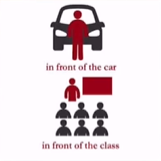
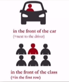

# Lesson 39：Don't drop it!（别刷了！）

## 一：如何表达“小心”？

Be careful!（小心！）

其中，“Be”也就是之前所学到的“Be动词”的原型。

---
## 二：如何表达“别哭”？

Don't cry.（别哭）

“Don't”的意思是“不要...”，详细的认识这个词需要到“[Lesson 47](./Lesson-47.md)”。

---
## 三：“give sb. sth.”的变体？

### 语法体的变体：give sth. to sb.

它和语法体“[give sb. sth.](./Lesson-21.md#give-sb-sth)”的含义相同，只是结构有所差别。

??? note "练习"
     
    1. book 
    ①：Give me the book.（give sb. sth.） 
    ②：Give the book to me.（give sth. to sb.） 
     
     
    2. vase 
    ①：Give me the vase.（give sb. sth.） 
    ②：Give the vase to me.（give sth. to sb.） 

---
### 四：do with sth.（处理某事）

**do whit sth.**

??? note "练习"
    1. refrigerator 
    ①：What's he going to do with that refrigerator?（他要拿那台冰箱做什么？ | 彼はその冷蔵庫をどうするつもりですか?） 
    ②：He's going to clean it.（他要将其清洁一下。 | 彼はそれをきれいにします。） 
     
    2. old car 
    ①：What are you going to do with that old car?（你打算怎么处理那辆旧车？ | その古い車をどうするつもりですか？） 
    ②：I'm going to give Sam the car.（我打算把车送给萨姆。 | サムに車をあげるつもりです。） 

---
??? note "单词"
    **/frʌnt/** 
    **front**&nbsp;&nbsp;`n.前面` 
    补充： 
    1. in front of（在...的前面） 
     
    2. in the front of（在...[物体/人群]当中的前面） 
     
     
    **/ˈkeəfl/** 
    **careful**&nbsp;&nbsp;`adj.小心的，仔细的` 
     
    **英：/vɑːz/，美：/veɪs/** 
    **vase**&nbsp;&nbsp;`n.花瓶` 
     
    **/drɒp/** 
    **drop**&nbsp;&nbsp;`v.掉下，摔下` 
     
    **/flaʊə/** 
    **flower**&nbsp;&nbsp;`n.花` 
     

??? note "语法练习"

