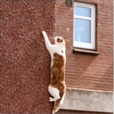
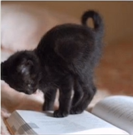
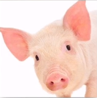
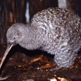
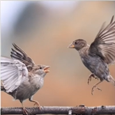
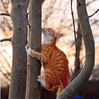
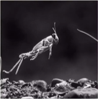

# Lesson 43：Hurry up!（快点！）

## 一：如何使用情态动词“can（能）”？

### 什么是情态动词？

“情态动词”是一种本身有一定的词义的词汇，表示说话人对有关行为或事物的态度、情感和看法等。

### 情态动词“can”

情态动词“can”的用法多样，通常被直译为“能、可以、会”。

### 语法：情态动词“can”的肯定句

**结构：主语 + can + do[v.动词原型]**

??? note "例子"
     
    1. bird 
    Bird can fly in the sky.（鸟可以在天空飞翔。 | 鳥は空を飛べる。） 
     
     
    2. dog 
    Dog can swim in the river.（狗可以在河中游。 | 犬は川で泳げる。） 
     
     
    3. cat 
    Cat can climb the wall.（猫可以爬墙。 | 猫は壁を登れる。）

### 语法：情态动词“can”的否定句

**结构：主语 + can + not + do[v.动词原型]**

**cannot = can not = can't*

??? note "例子"
     
    1. cat 
    Cat can't read a book.（猫读不了书。 | 猫は本が読めません。） 
     
     
    2. elephant 
    Elephant can't jump.（大象不能跳跃。 | 象はジャンプできません。） 
     
     
    3. pig 
    Pig can't look at the sky.（猪看不了天空。 | 豚には空が見えません。）

### 语法：情态动词“can”的一般疑问句

**结构：Can + 主语 + do[v.动词原型]?**

??? note "例子"
     
    1. me 
    Can you help me?  -- Yes, I can. / No, I can't. （你能帮帮我吗？ -- 可以。/ 不，我不行。 | 手伝ってもらえませんか？ -- はい、いいです。/ いいえ、できません。） 
     
     
    2. dog 
    Can the dog swim?  -- Yes, it can. （狗可以游泳吗？ -- 是的，可以。 | 犬は泳げますか？ | はい、犬ならできます。） 
     
     
    3. kiwi 
    Can kiwi fly?  -- No, it can't. （鹬鸵[yu tuo]可以飞吗？ -- 不，不能。 | キウイは飛べるのか？ -- いいえ、キウイはできません。） 

### 语法：情态动词“can”的特殊疑问句

**结构：What + can + 主语 + do[v.动词原型]?**

??? note "例子"
     
    1. bird 
    What can the bird do?（鸟可以做什么？ | 鳥は何ができますか？） 
    -- It can dance.（它能跳舞。 | 鳥は踊ることができます。）
     
     
    2. dog 
    What can the cat do?（猫可以做什么？ | 猫は何ができますか？） 
    -- It can climb a tree.（它可以爬树。 | 猫は木に登れる。） 
     
     
    3. grasshopper 
    What can the grasshopper do?（蝗虫可以做什么？ | イナゴは何ができますか？） 
    -- It can jump.（它可以跳。 | イナゴはジャンプができる。） 

---
??? note "单词"
    **/əv-'kɔːs/** 
    **of course**&nbsp;&nbsp;`当然` 
     
    **/ˈketl/** 
    **kettle**&nbsp;&nbsp;`n.[C]水壶` 
     
    **/bɪˈhaɪnd/** 
    **behind**&nbsp;&nbsp;`prep.在...的后面` 
     
    **/ˈtiːpɒt/** 
    **teapot**&nbsp;&nbsp;`n.[C]茶壶` 
     
    **/naʊ/** 
    **now**&nbsp;&nbsp;`adv.现在` 
     
    **/faɪnd/** 
    **find**&nbsp;&nbsp;`v.找到` 
     
    **/bɔɪl/** 
    **boil**&nbsp;&nbsp;`v.沸腾` 
     

??? note "语法练习"

