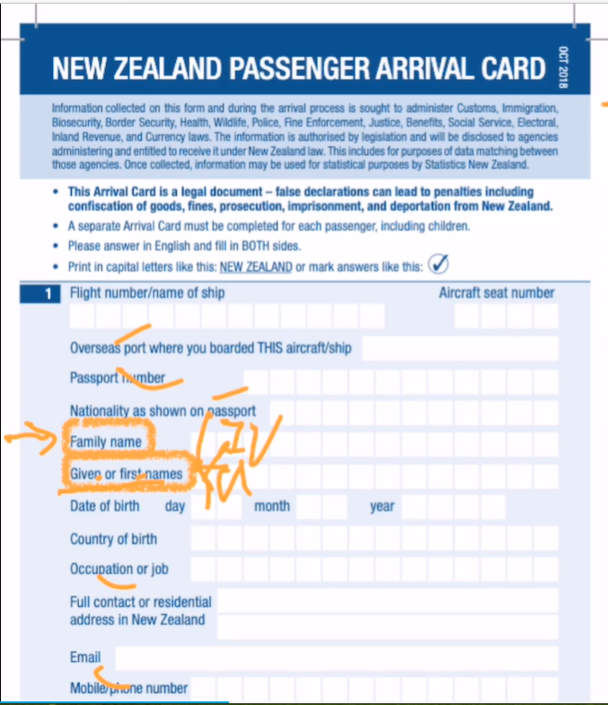

# Lesson 5: Nice to meet you.（很高兴见到你）

### 一：如何区分英文中的姓与名？

在汉语当中，姓名是“姓在前，名在后”（例：孔[姓] 阳泽[名]）。 

在英文当中顺序恰好相反，为“名在前，姓在后”（例：Stephen[名] William[中间名] Hawking[姓]（斯蒂芬·威廉·霍金）） 
> 补充： 
> [名]：first name/given name（第一个名字/别人给起的名字） 
> [中间名]：middle name 
> [姓]：surname/family name/last name（名字的姓/家族的名字/最后一个出现的姓） 

---
### 二：入境登记卡（Arrival card）

---
### 三：如何表达“我也是”？

---
??? note "单词"
    **/mɪstə/** 
    **Mr.**&nbsp;&nbsp;`n.（用于男子的姓氏或姓名前）先生[常用]` 
    例：Mr. Bean（潘豆先生） 
    补充：Mr. +（last name/surname）（最后一个出现的姓/名字当中的姓） 
    例（chitchat）：Mr. Blake; call me David please.（Blake先生；管我叫 David 就行了。）  
     
    **/mɪstə/** 
    **Miss.**&nbsp;&nbsp;`n.(用于未婚女子姓氏或姓名前)小姐，女士[常用]` 
     
    **/ˈmɪsɪz/** 
    **Mrs.**&nbsp;&nbsp;`n.(用于已婚女子姓氏或姓名前)小姐，女士` 
     
    **/mɪz/** 
    **Ms.**&nbsp;&nbsp;`n.（用于婚姻状况不明或不愿提及婚姻状況的女子的姓氏或姓名之前）小姐，女士` 
     
    **/ˌɡʊd ˈmɔː.nɪŋ/** 
    **good morning**&nbsp;&nbsp;`int.（上午见面时用语）早上好，上午好` 
    补充： 
    ①：非正式场合常说 Morning ； 
    ②：还有以下的词： 
    good afternoon（/ˌɡʊd ˌɑːf.təˈnuːn/，中午好） 
    good evening（/ˌɡʊd ˈiːv.nɪŋ/，下午好） 
    good night（/ˌɡʊd ˈnaɪt/，晚上好） 
     
    **/njuː/** 
    **new**&nbsp;&nbsp;`adj.刚出现的; 新的` 
     
    **/ˈstjuːdənt/** 
    **new**&nbsp;&nbsp;`n.学生` 
    补充：一个单词如果最前面为 /s/ 随后跟着一个清辅音的话，后面的清辅音需要变为相对应的浊辅音。 
    例：/ˈstjuːdənt/ --> /ˈsdjuːdənt/ 
     
    **/frentʃ/** 
    **French**&nbsp;&nbsp;`adj.法国的；n.法国人，法国` 
     
    **/ˈdʒɜːmən/** 
    **German**&nbsp;&nbsp;`adj.德国的；n.德国人，德国` 
     
    **/ˌdʒæpəˈniːz/** 
    **Japanese**&nbsp;&nbsp;`adj.日本的; 日本人的；n.日本人; 日语；` 
    补充（chitchat）：夸赞他们国家的特色食品也是一个很好的搭讪方式（例：I love sushi.(我喜欢你们那边的寿司)）
     

??? note "短语"
    **Nice to meet you**&nbsp;&nbsp;`（用于初次与朋友或同学见面等非正式的场合）很高兴见到你` 
    补充： 
    How do you do?（相对比较正式的问候，现在几乎没人用，您好） 
    How are you.（你好吗） 
    Hi.（氦(bushi)，嗨！） 
     

