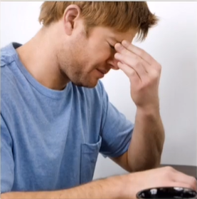

# Lesson 63：Thank you, doctor.（谢谢你，医生。）

## 一：情态动词“must”

对于情态动词，我们在[第四十三章](./Lesson-43.md)当中就已有所耳闻了。

“must”一词表“必须”的意思。

“must”在句子当中的变换方式与第四十三章当中所学到的另一个情态动词“can”相似。

### 语法：情态动词“must”的肯定句

**结构：主语 + must + do[v.动词原型]**

??? note "例子"
     
    1. hungry 
    I'm so hungry. I must eat some food.（我太饿了。我必须吃点东西。 | お腹が空いた。 食べないといけない。） 
     
     
    2. thirsty 
    I'm so thirsty. I must drink some water.（我很口渴。 我必须喝点水。 | 喉が渇いた。 水を飲まないといけない。） 
     
     
    3. tired 
    He's so tired. He must go to bed now.（他太累了。 他现在必须去睡觉了。 | 彼はとても疲れていた，もう寝ないといけない。） 
     

### 语法：情态动词“must”的否定句

**结构：主语 + must + not + do[v.动词原型]**

**must not = mustn't*

**需要注意的是： ①：“mustn't”意为“禁止、不许”，而并非“不必须”之意； ②：由于其通常用来表达命令等表强烈的语气，因此在日常对话当中勿轻易使用。**

??? note "例子"
     
    1. smoke 
    You mustn't smoke here.（你不可以在这里抽烟。 | ここでタバコを吸ってはいけません。） 
     
     
    2. stay 
    You mustn't stay here.（你不能在这里逗留。 | ここにいてはいけません。） 
     

### 语法：情态动词“must”的一般疑问句

**结构：Must + 主语 + do[v.动词原型]?**

**“must”做一般疑问句的用法在现实当中并不常见。*

??? note "例子"
     
    ①：Must he go?（他一定要去吗？ | 彼は行かなければいけない？） 
    ②：Yes, he must.（是的，他得去。 | はい、行かなければいけない。） 
    ③：No, he mustn't.（不，他不能去。 | いいえ、いけません。） 
     

### 语法：情态动词“can”的特殊疑问句

**结构：What + must + 主语 + do?**

??? note "例子"
     
    ①：What must she do?（她必须做什么？ | 彼女は何をしなければなりませんか?） 
    ②：She must clean her bedroom.（她必须打扫她的卧室。 | 彼女は寝室を掃除しなければなりません。） 
     

---
## 二：如何表达“当然了 & 没问题”？

certainly（/ˈsɜːtnli/，adv.当然、可以）

---
??? note "单词"
    **/ˈbetə/** 
    **better**&nbsp;&nbsp;`adj.较好的，更好的[well的adj比较级]` 
     
    **/ˈsɜːtnli/** 
    **certainly**&nbsp;&nbsp;`adv.当然、可以` 
     
    **/ˈɡet-ʌp/** 
    **get up**&nbsp;&nbsp;`起床` 
    相似：wake up（/weɪk-ʌp/，醒来） 
    它们之间的关系是：wake up at 6, but remain in bed, and get up at 8.（6点醒来，但仍躺在床上，8点起床。） 
     
    **/jet/** 
    **yet**&nbsp;&nbsp;`adv.还，仍` 
     
    **/rɪtʃ/** 
    **rich**&nbsp;&nbsp;`adj.油腻的` 
    例子： 
    ①：rich food（油腻的食物。 | 油っこい食べ物） 
    ②：I don't like rich food.（我不喜欢油腻的食物。 | 脂っこい食べ物は好きではありません。） 
     
    **/fuːd/** 
    **food**&nbsp;&nbsp;`n.[C/U]食物` 
     
    **/rɪˈmeɪn/** 
    **remain**&nbsp;&nbsp;`v.保持，继续` 
    例子： 
    ①：He must remain in bed.（他必须继续躺在床上。 | 彼はベッドにいたままでなければなりません。） 
    ②：He mustn't get up yet.（他还不能起来。 | 彼はまだ起きることがいけません。） 
     

??? note "短语"
    **certainly**&nbsp;&nbsp;`当然了/没问题` 
     

??? note "语法练习"
    一：仿照例句提问 
    例：park my car here 
    - Can I park my car here? 
     
    ①：use your pencil 
    - Can I use your pencil? 
    ②：sit here 
    - Can I sit here? 
    ③：borrow your bike 
    - Can I borrow your bike? 
    ④：come to your house 
    - Can I come to your house? 
    ⑤：stay in bed today 
    - Can I stay in bed today? 
    ⑥：look at your new dress 
    - Can I look at your new dress? 
     
    二：仿照例句用所给的词回答下列问题 
    例①：How long must he stay in bed?（a week） 
    - He must stay in bed for a week. 
    ①：How long must I take the medicine?（three days） 
    - You must take the medicine for three days. 
    ②：How long must she work?（eight hours every day） 
    - She must work for eight hours every day. 
    ③：How long must you play the piano?（about an hour every day） 
    - I must play the piano for about an hour every day. 
     
    例②：How long can I use your bike?（two weeks） 
    - You can use my bike for two weeks. 
    ①：How long can you live here?（about three months） 
    - I can live here for about three months. 
    ②：How long can students keep books from the library?（two months） 
    - Students can keep books from the library for two months. 
    ③：How long can Mary play in the garden?（about two hours） 
    - She can play in the garden for about two hours. 
     
    三：仿照例句用所给的词回答下列问题 
    例：Why mustn't he open the window?（have a bad cold） 
    - Because he has a bad cold. 
     
    ①：Why mustn't she go to school today?（have measles） 
    - Because she has measles. 
    ②：Why mustn't I swim in the river?（have an earache） 
    - Because I have an earache. 
    ③：Why mustn't he eat an ice cream?（have an toothache） 
    - Because he has an toothache. 

