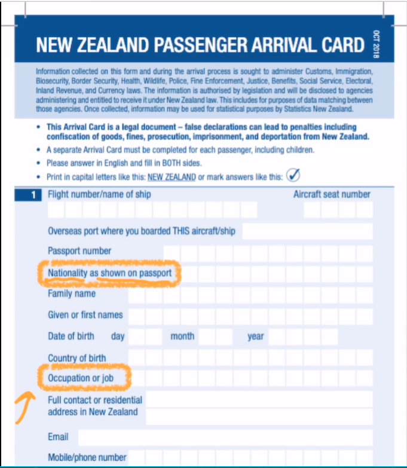

# Lesson 7：Are you a teacher?（你是教师吗？）


## 一：如何询问别人从哪里来的？

<font size=5>**What nationality are you?**</font>&nbsp;&nbsp;<font size=4>`（偏正式的用法）你是什么国籍的？`</font><br>
补充：<br>
Where are you from?[（平常说法）你来自于哪里的？ | あなたの出身はどこですか。]<br>


---
## 二：如何询问别人的工作？

<font size=5>**What's your job?**</font>&nbsp;&nbsp;<font size=4>`你是干什么工作的？（一般情况下不要轻易询问）`</font><br>
补充：<br>
在一般情况下我们并不能直接询问对方的职业，我们可以使用以下的句子来替换：<br>
What do you do?（你是干什么的？）<br>
What do you do for a living?（你是靠什么营生的？）<br>
例：<br>
What's your job?（你是干什么工作的？）<br>
I'm an English teacher.（我是一位英语教师。）<br>


---
## 三：入境登记卡（Arrival card）[国籍与职业]




---
## 四：特殊疑问句 与 一般疑问句

<font size=4 color=red>**特殊疑问句 = 特殊疑问词（如：what、where等） + 一般疑问句（去掉答案）**</font>

> 例：<br>
> My name is Marisa.<br>
> <font color=orange>Is</font> your name Marisa?（一般疑问句）<br>
> She is from Italy.<br>
> <font color=orange>Is</font> she from Italy?（一般疑问句）<br>

```text
一般疑问句 --> 特殊疑问句

 ┌-----------------------------┐
 ↓                             |
     Is your name (Marisa --> what)? 

What is your name?


 ┌----------------------------┐
 ↓                            |
     Is she from (Italy --> where)? 

Where is she from?
```

### 如何区分一段话为特殊疑问句，还是一般疑问句呢？
能用yes / no回答的问句为一般疑问句，不能够使用yes / no回答的问句便是特殊疑问句。


---
??? note "单词"
    **/aɪ/**<br>
    <font size=5>**I**</font>&nbsp;&nbsp;<font size=4>`n.我`</font><br>
    <br>
    **/əm/**<br>
    <font size=5>**am**</font>&nbsp;&nbsp;<font size=4>`v.是`</font><br>
    <br>
    **/ɑː(r) , eə(r)/**<br>
    <font size=5>**are**</font>&nbsp;&nbsp;<font size=4>`v.是`</font><br>
    <br>
    **/ˌnæʃəˈnæləti/**<br>
    <font size=5>**nationality**</font>&nbsp;&nbsp;<font size=4>`n.国籍`</font><br>
    <br>
    **/dʒɒb/**<br>
    <font size=5>**job**</font>&nbsp;&nbsp;<font size=4>`n.工作，职业`</font><br>
    <br>
    **/ˈkiːbɔːd/**<br>
    <font size=5>**keyboard**</font>&nbsp;&nbsp;<font size=4>`n.键盘`</font><br>
    补充：key + board；<br>
    <br>
    **/ˈɒpəreɪtə/**<br>
    <font size=5>**operator**</font>&nbsp;&nbsp;<font size=4>`n.操作员，技工`</font><br>
    补充：<br>
    or或er结尾的单词都可以表示职业。<br>
    <br>
    **/ˌendʒɪˈnɪə/**<br>
    <font size=5>**engineer**</font>&nbsp;&nbsp;<font size=4>`n.工程师`</font><br>
    补充：<br>
    or或er结尾的单词都可以表示职业。<br>
    <br>


??? note "语法"
    <font size=4 color=red>**特殊疑问句 = 特殊疑问词（如：what、where等） + 一般疑问句（去掉答案）**</font>

    > 例：<br>
    > My name is Marisa.<br>
    > <font color=orange>Is</font> your name Marisa?（一般疑问句）<br>
    > She is from Italy.<br>
    > <font color=orange>Is</font> she from Italy?（一般疑问句）<br>

    ```text
    一般疑问句 --> 特殊疑问句

     ┌-----------------------------┐
     ↓                             |
         Is your name (Marisa --> what)? 

    What is your name?


     ┌----------------------------┐
     ↓                            |
         Is she from (Italy --> where)? 

    Where is she from?
    ```


??? note "短语"
    <font size=5>**I am ...**</font>&nbsp;&nbsp;<font size=4>`我是...`</font><br>
    例：<br>
    I am a/an ...（我是一位...。 | 私は…です。）<br>
    <br>
    <font size=5>**Your are ...**</font>&nbsp;&nbsp;<font size=4>`你是...`</font><br>
    补充：<br>
    Are you ...?（你是...吗？）<br>
    <br>
    <font size=5>**He/She/It is ...**</font>&nbsp;&nbsp;<font size=4>`他/她/它是...`</font><br>
    例：<br>
    ①：He is my teacher.（他是我的老师。 | 彼は私の先生です。）<br>
    ②：Is she your teacher?（她是你的老师吗？ | この方は君の先生ですか。）<br>
    ③：Is it a cat?（它是一只猫吗？ | これは猫ですか。）<br>
    <br>
    <font size=5>**What nationality are you?**</font>&nbsp;&nbsp;<font size=4>`（偏正式的用法）你是什么国籍的？`</font><br>
    补充：<br>
    Where are you from?[（平常说法）你来自于哪里的？ | あなたの出身はどこですか。]<br>
    <br>
    <font size=5>**What's your job?**</font>&nbsp;&nbsp;<font size=4>`你是干什么工作的？（一般情况下不要轻易询问）`</font><br>
    补充：<br>
    在一般情况下我们并不能直接询问对方的职业，我们可以使用以下的句子来替换：<br>
    What do you do?（你是干什么的？）<br>
    What do you do for a living?（你是靠什么营生的？）<br>
    例：<br>
    What's your job?（你是干什么工作的？）<br>
    I'm an English teacher.（我是一位英语教师。）<br>
    <br>


??? note "语法练习"
    ```text
    1.用 am/is/are 填空
    ①：I *am* a new student. My name *is* Alice.
    ②：*Are* you a new student, too?  -- Yes, I *am*.
    ③：What *is* you job?  -- I *am* a keyboard operator.
    ④：I *am* a English teacher. My sister *is* an English teacher, too.


    2.仿照例句回答问题
    例：
    Are you a boy?  -- *Yes, I am./No, I'm not. I'm a girl.*
    Are you Mary?(Jane)  -- *No, I'm not. I am Jane.*

    ①：Are you a giri?  -- *Yes, I am./No, I'm not. I'm a boy.*
    ②：Are you an engineer? -- *Yes, I am./No, I'm not. I'm a keyboard operator.*
    ③：Are you Chinese?(Korean)  -- *No, I'm not. I'm Korean.*
    ④：Are you a mechanic?(policeman)  -- *No, I'm not. I'm a policeman.*


    3.仿照例句回答问题
    例：
    Are you a teacher?(yes)  -- *Yes, I am.*
    What nationality are you?(English)  -- *I'm English.*
    What's your job?(nurse)  -- *I'm a nurse.*

    ①：Are you an engineer?(no/mechanic)  -- *No, I am not. I'm an mechanic.*
    ②：What nationality is he?(Swedish)  -- *I'm Swedish.*
    ③：Is she Korean or Japanese?(Japanese)  -- *She's Japanese.*
    ```

