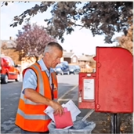

# Lesson 8：What's your job?（你是做什么工作的？）


## 一：他？他的？她？她的？

| 他 | 他的 | 她 | 她的 |
| -- | --- | -- | --- |
| he | his | she | her |


??? note "练习"
    <font size=5>**1.policeman**<br></font>
    <br>
    ①：What's <font color=orange>his</font> job?<br>
    ②：Is <font color=orange>he</font> a policeman or a taxi driver?<br>
    ③：He isn't a taxi driver.<br>
    ④：He's a policeman.<br>
    <br>
    <font size=5>**2.taxi driver**<br></font>
    <br>
    ①：What's <font color=orange>his</font> job?<br>
    ②：Is <font color=orange>he</font> a taxi driver or a policeman?<br>
    ③：He isn't a policeman.<br>
    ④：He's a taxi driver.<br>
    <br>
    <font size=5>**3.policewoman**<br></font>
    <br>
    ①：What's <font color=orange>her</font> job?<br>
    ②：Is <font color=orange>she</font> a policewoman or an air hostess?<br>
    ③：She isn't an air hostess.<br>
    ④：She's a policewoman.<br>
    <br>
    <font size=5>**4.air hostess / flight attendant**<br></font>
    <br>
    ①：What's <font color=orange>her</font> job?<br>
    ②：Is <font color=orange>she</font> a air hostess or a policewoman?<br>
    ③：She isn't a policewoman.<br>
    ④：She's an air hostess.<br>
    <br>
    <font size=5>**5.postman**<br></font>
    <br>
    ①：What's <font color=orange>his</font> job?<br>
    ②：Is <font color=orange>he</font> a postman or a milkman?<br>
    ③：He isn't a milkman.<br>
    ④：He's a postman.<br>
    <br>
    <font size=5>**6.milkman**<br></font>
    <br>
    ①：What's <font color=orange>his</font> job?<br>
    ②：Is <font color=orange>he</font> a milkman or a postman?<br>
    ③：He isn't a postman.<br>
    ④：He's a milkman.<br>
    <br>
    <font size=5>**7.nurse**<br></font>
    <br>
    ①：What's <font color=orange>her</font> job?<br>
    ②：Is <font color=orange>she</font> a nurse or a housewife?<br>
    ③：She isn't a housewife.<br>
    ④：She's a nurse.<br>
    <br>
    <font size=5>**8.housewife**<br></font>
    <br>
    ①：What's <font color=orange>her</font> job?<br>
    ②：Is <font color=orange>she</font> a housewife or a nurse?<br>
    ③：She isn't a nurse.<br>
    ④：She's a housewife.<br>
    <br>
    <font size=5>**9.mechanic**<br></font>
    <br>
    ①：What's <font color=orange>his</font> job?<br>
    ②：Is <font color=orange>he</font> a mechanic or a hairdresser?<br>
    ③：He isn't a hairdresser.<br>
    ④：He's a mechanic.<br>
    <br>
    <font size=5>**10.hairdresser**<br></font>
    <br>
    ①：What's <font color=orange>his</font> job?<br>
    ②：Is <font color=orange>he</font> a hairdresser or a mechanic?<br>
    ③：He isn't a mechanic.<br>
    ④：He's a hairdresser.<br>
    <br>


---
??? note "单词"
    **/hiː/**<br>
    <font size=5>**he**</font>&nbsp;&nbsp;<font size=4>`pron.他`</font><br>
    <br>
    **/ʃi/**<br>
    <font size=5>**she**</font>&nbsp;&nbsp;<font size=4>`pron.她`</font><br>
    <br>
    **/hɪz/**<br>
    <font size=5>**his**</font>&nbsp;&nbsp;<font size=4>`det.他的`</font><br>
    <br>
    **/hə(r)/**<br>
    <font size=5>**her**</font>&nbsp;&nbsp;<font size=4>`det.她的`</font><br>
    <br>
    **/pəˈliːsmən/**<br>
    <font size=5>**policeman**</font>&nbsp;&nbsp;<font size=4>`n.警察; 男警察`</font><br>
    <br>
    **/pəˈliːswʊmən/**<br>
    <font size=5>**policewoman**</font>&nbsp;&nbsp;<font size=4>`n.女警察`</font><br>
    <br>
    **/ˈtæksi ˈdraɪvə(r)/**<br>
    <font size=5>**taxi driver**</font>&nbsp;&nbsp;<font size=4>`n.出租车司机; 计程车司机`</font><br>
    <br>
    **/ˈeə həʊstəs/**<br>
    <font size=5>**air hostess**</font>&nbsp;&nbsp;<font size=4>`n.空姐，空中小姐`</font><br>
    <br>
    **/ˈpəʊst.mən/**<br>
    <font size=5>**postman**</font>&nbsp;&nbsp;<font size=4>`n.邮递员`</font><br>
    <br>
    **/nɜːs/**<br>
    <font size=5>**nurse**</font>&nbsp;&nbsp;<font size=4>`n.护士`</font><br>
    <br>
    **/məˈkænɪk/**<br>
    <font size=5>**mechanic**</font>&nbsp;&nbsp;<font size=4>`n.技工; 力学; 机械师`</font><br>
    <br>
    **/ˈheədresə/**<br>
    <font size=5>**hairdresser**</font>&nbsp;&nbsp;<font size=4>`n.理发师; 美发师`</font><br>
    <br>


??? note "语法练习"
    ```text
    1.使用 a/an 来填写句子
    ①：My name is Thomas. I am *an* Italian student.
    ②：This is *an* umberlla. It's *an* old umberlla.
    ③：This is *an* English car. It's *a* Mini.
    ④：What make is it?  -- It's a ford.


    2.仿照例句用所给的词提问并回答
    例：
    your/milkman
    What's your job?  -- I'm a milkman.

    ①：your/engineer
    What's your job?  -- I'm an engineer.
    ②：her/keyboard operator
    What's your job?  -- I'm a keyboard operator.
    ③：he/housewife
    What's your job?  -- I'm a housewife.


    3.仿照例句回答问题
    例：Is he an enngineer or a mechanic?(engineer)  -- *He isn't a mechanic. He's an engineer.*

    ①：Are you a taxi driver or a mechanic?(taxi driver)  -- I'm not a mechanic. I'm a taxi driver.
    ②：Is she a nurse or doctor?(doctor)  -- She isn't a nurse. She's a doctor.
    ②：Is your sister a nurse or an air hostess?(air hostess)  -- She isn't a nurse. She's an air hostess.
    ```
