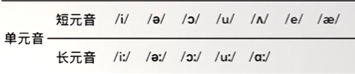
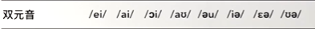

# 元音音标

## 英语国际音标表

---
## 一：单元音

### 1./i/ 与 /iː/

#### /i/ = /ɪ/（短元音）

??? note "《新概念英语》第一册中涉及到读 **/ɪ/** 的单词"
    **miss**&nbsp;&nbsp;`/mɪs/` 
    **big**&nbsp;&nbsp;`/bɪɡ/` 
    **is**&nbsp;&nbsp;`/ɪz/` 
    **it**&nbsp;&nbsp;`/ɪt/` 
    **this**&nbsp;&nbsp;`/ðɪs/` 

#### /iː/（长元音）

??? note "《新概念英语》第一册中涉及到读 **/iː/** 的单词"
    **me**&nbsp;&nbsp;`/miː/` 
    **please**&nbsp;&nbsp;`/pliːz/` 
    **teacher**&nbsp;&nbsp;`/ˈtiːtʃə(r)/` 
    **meet**&nbsp;&nbsp;`/miːt/` 
    **see**&nbsp;&nbsp;`/siː/` 

---
### 2./ə/ 与 /əː/

#### /ə/（短元音）

??? note "《新概念英语》第一册中涉及到读 **/ə/** 的单词"
    **umbrella**&nbsp;&nbsp;`/ʌmˈbrel.ə/` 
    **number**&nbsp;&nbsp;`/ˈnʌm.bə(r)/` 
    **teacher**&nbsp;&nbsp;`/ˈtiːtʃə(r)/` 
    **daughter**&nbsp;&nbsp;`/ˈdɔː.tə(r)/` 
    **perhaps**&nbsp;&nbsp;`/pə(r)ˈhæps/` 

#### /əː/ = /ɜː/（长元音）

??? note "《新概念英语》第一册中涉及到读 **/əː/** 的单词"
    **sir**&nbsp;&nbsp;`/sɜːr/` 
    **shirt**&nbsp;&nbsp;`/ʃɜːt/` 
    **skirt**&nbsp;&nbsp;`/skɜːt/`&nbsp;ps：/skɜːt/ --> /sgɜːt/ 
    **nurse**&nbsp;&nbsp;`/nɜːs/` 
    **dirty**&nbsp;&nbsp;`/ˈdɜː.ti/` 

---
### 3./ɔ/ 与 /ɔː/

#### /ɒ/ = /ɔ/（短元音）

??? note "《新概念英语》第一册中涉及到读 **/ɔ/** 的单词"
    **watch**&nbsp;&nbsp;`/wɒtʃ/` 
    **what**&nbsp;&nbsp;`/wɒt/` 
    **job**&nbsp;&nbsp;`/dʒɒb/` 
    **dog**&nbsp;&nbsp;`/dɒɡ/` 
    **orange**&nbsp;&nbsp;`/ˈɒr.ɪndʒ/` 

#### /ɔː/（长元音）

??? note "《新概念英语》第一册中涉及到读 **/ɔː/** 的单词"
    **your**&nbsp;&nbsp;`/jɔː(r)/` 
    **tall**&nbsp;&nbsp;`/tɔːl/` 
    **short**&nbsp;&nbsp;`/ʃɔːt/` 
    **daughter**&nbsp;&nbsp;`/ˈdɔː.tə(r)/` 
    **keyboard**&nbsp;&nbsp;`/ˈkiː.bɔːd/` 

---
### 4./u/ 与 /uː/

#### /ʊ/ = /u/（短元音）

??? note "《新概念英语》第一册中涉及到读 **/u/** 的单词"
    **book**&nbsp;&nbsp;`/bʊk/` 
    **good**&nbsp;&nbsp;`/ɡʊd/` 
    **look**&nbsp;&nbsp;`/lʊk/` 

#### /uː/（长元音）

??? note "《新概念英语》第一册中涉及到读 **/uː/** 的单词"
    **food**&nbsp;&nbsp;`/fuːd/` 
    **school**&nbsp;&nbsp;`/skuːl/` 
    **too**&nbsp;&nbsp;`/tuː/` 
    **whose**&nbsp;&nbsp;`/huːz/` 
    **blue**&nbsp;&nbsp;`/bluː/` 

---
### 5./ʌ/ 与 /ɑː/

#### /ʌ/（短元音）

??? note "《新概念英语》第一册中涉及到读 **/ʌ/** 的单词"
    **son**&nbsp;&nbsp;`/sʌn/` 
    **but**&nbsp;&nbsp;`/bʌt/` 
    **much**&nbsp;&nbsp;`/mʌtʃ/` 
    **come**&nbsp;&nbsp;`/kʌm/` 
    **color**&nbsp;&nbsp;`/ˈkʌl.ə(r)/` 

#### /ɑː/（长元音）

??? note "《新概念英语》第一册中涉及到读 **/ɑː/** 的单词"
    **father**&nbsp;&nbsp;`/ˈfɑː.ðə(r)/` 
    **pardon**&nbsp;&nbsp;`/ˈpɑːdn/` 
    **car**&nbsp;&nbsp;`/kɑː(r)/` 
    **smart**&nbsp;&nbsp;`/smɑːt/` 
    **carpet**&nbsp;&nbsp;`/ˈkɑː.pɪt/` 

---
### 6./e/（短元音）

??? note "《新概念英语》第一册中涉及到读 **/e/** 的单词"
    **yes**&nbsp;&nbsp;`/jes/` 
    **very**&nbsp;&nbsp;`/ˈveri/` 
    **pen**&nbsp;&nbsp;`/pen/` 
    **dress**&nbsp;&nbsp;`/dres/` 
    **well**&nbsp;&nbsp;`/wel/` 

---
### 7./æ/（短元音）

??? note "《新概念英语》第一册中涉及到读 **/æ/** 的单词"
    **hand**&nbsp;&nbsp;`/hænd/` 
    **bag**&nbsp;&nbsp;`/bæɡ/` 
    **am**&nbsp;&nbsp;`/æm/` 
    **fat**&nbsp;&nbsp;`/fæt/` 
    **catch**&nbsp;&nbsp;`/kætʃ/` 

---
## 二：双元音

