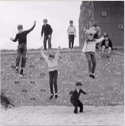

# Lesson 36：Where ...?（...在哪里？）

!!! note "练习"
    be(am/is/are) + v.ing + 介词 
     
     
    1. into the shop 
    ①：Where's the man going? 
    ②：He's going into the shop. 
     
     
    2. out of the shop 
    ①：Where's the she doing? 
    ②：She's going out of the shop. 
     
     
    3. walking acroos the street 
    ①：Where are the man and the woman walking? 
    ②：They're walking acroos the street.
     
     
    4. jumping off the wall 
    ①：Where are the children jumping? 
    ②：They're jumping off the wall. 
     
     
    5. sitting near the tree 
    ①：Where's the girl sitting? 
    ②：She's sitting near the tree. 
     
     
    6. over the bridge 
    ①：Where's the plane flying? 
    ②：It's flying over the bridge. 

---
??? note "单词"
    **/bɪˈsaɪd/** 
    **beside**&nbsp;&nbsp;`prep.在...的旁边` 
     
    **/ɒf/** 
    **off**&nbsp;&nbsp;`prep.离开` 
     

??? note "语法练习"

