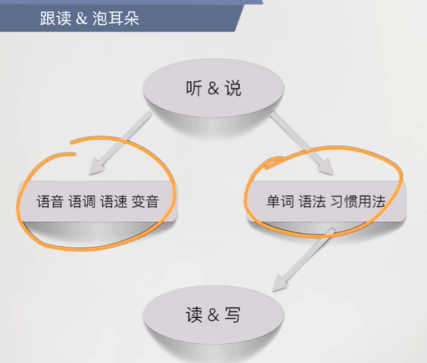

# 新概念英语第一册笔记

跟学视频：<a href="https://www.bilibili.com/video/BV1xa411J7jJ" target="_blank">新概念英语第一册 全书更新完 Leo老师讲解</a>

## 准备
### 1.教材准备
!!! note "教材准备"
    ①：新概念第一册；
    
    ②：新概念一册英语语法练习；
    
    ③：剑桥初级英语语法。

### 2.可能还需要准备的
!!! note "可能还需要准备的"
    电子词典；

    新概念文章与音频；

    纸与笔；

    配套的学习资料

    等......

## 指南
### 1.听与说方面

### 2.练习方面

#### 为什么要写练习呢？
<b>主要</b>是练习语法的使用熟练度。
通过练习的方式来提升运用熟练度，进而能够逐渐记住并掌握相对应的语法知识。

在学习上所掌握的语法知识在实际应用中可能会发生较大的变数（学习和实际应用是两码事）。

#### 如何进行练习？

??? note "对于 “新概念一册英语语法练习”来说"
    每学完一节课便进行练习，练习完了也不要忘记对答案。
    
    如果发现了自己不太懂的语法点/单词的话，可以查询语法书/词典。
    
    查询完之后实在不太懂的，可以在相对应的学习群提问/在网上搜索与此相关的问题等。
    
??? note "对于“剑桥初级英语语法”来说"
    可以在Contents（目录）中查询学习到的语法点。

    在Index（索引）中查询学习到的单词。

    > 注：Index（索引）部分查询到的数字为单元数。

    主要注重的是里面的来自于真实语料库的练习题。

### 3.Ask me if & Comprehension（口语听力练习）

??? note "“口语听力练习”的原因是？"
    来源于中文与英语之间的语法构成区别，为了能够达到一说便是正确的语法构成，因此需要进行练习。

??? note "怎么样来进行“口语听力练习”呢？"
    注：以下建议来自于网络

    1.多说，英语口语自学的过程中，一定要多说英语。一定要把学习英语当作是一件有趣的事情来做，这样才可以学好英语。不要过分强调说法，只要发音准确，就可以顺利交流。你可以在网上找一些外国人，和他们交流思想和看法，让英语成为日常生活的一部分，而不是负担。

    2.多听。在你的生活中寻找一切可以听英语的机会。当别人在用英语说话的时候，你可以大胆的参与，听他们的发音，这样你就会在积累中慢慢改善发音，你的听力也会提高。如果这样的机会比较少，那么可以多听一些学过的课文，对语言语调的学习也有很大帮助。

    3.多读。读书分为两种，一种是默读，一种是朗读。朗读是学习语言必不可少的一种基本方法。阅读的内容可以是你的课本，也可以是读一些有趣的小读物，因为现在的英语考试越来越重视阅读量和阅读速度。

