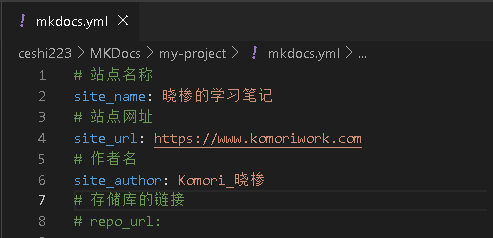

# MKDocs 的配置文件

在项目文件夹当中，除了`docs`的文件夹以外，还有一个名为`mkdocs.yml`的文件。

此文件就是这个项目的配置文件，

---
### <font color=red>site_name</font>
代表用于项目文档的主标题，<font color=red>必填项</font>。

??? note "展示效果"
    
    

---
### site_url
代表用于项目文档的规范网址。

!!! info "提示"
    虽说在<a href='https://www.mkdocs.org/getting-started/#creating-a-new-project' target="_black">官方文档</a>中将此项描述为必填项<br>

    `The site_name and site_url configuration options are the only two required options in your configuration file.`<br>

    但在<a href='https://www.mkdocs.org/user-guide/configuration/#site_url' target="_black">这里</a>又将其描写为非必须项...<br>

    如果仅用于本地浏览的话可以不填。

默认值：`null`

---
### site_author
代表用于项目文档的作者名，添加后会在 HTML 的 head 中添加 meta 信息。

??? note "举个例子"

    ```yml
    # mkdocs.yml
    site_author: komori_晓椮
    ```
    ```html
    <!-- 页面 -->
    <html>
        <head>
            <meta name="author" content="komori_晓椮">
        </head>
    </html>
    ```

默认值：`null`

### repo_name


如其默认值为 `'GitHub'` 或 `'Bitbucket'`

### repo_url
提供指向存储库的链接（GitHub，Bitbucket，GitLab等）

默认值：`null`

