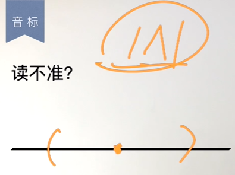

# 英语音标

跟学视频1：<a href="https://www.bilibili.com/video/BV1u84y1c7JE" target="_blank">英语 英式音标 国际音标 元音音标 Leo老师讲解</a> 
跟学视频2：<a href="https://www.bilibili.com/video/BV1zZ4y1F7F9" target="_blank">英语 英式音标 国际音标 辅音音标 Leo老师讲解</a> 
跟学视频3：<a href="https://www.bilibili.com/video/BV1CV41177pS" target="_blank">英语 英式音标 国际音标 重音 音节 变音 Leo老师讲解</a>

---
## 一：英语音标是什么？
英语音标（英文：Phonetic symbols）是一种用来表示英语语音的符号系统。它可以用来表示英语中的每个音素（音位），包括元音、辅音和浊音与清音等其他特征。 
> 例： 
> 汉语：猫（māo） 
> 英语：cat（/kæt/） 

在英语学习中，英语音标就相当于汉语拼音。

---
## 二：英语音标的种类
在中国国内常见的有三种音标： 
①：IPA（国际音标） 
②：KK（美式音标） 
③：DJ（英式音标） 

在《新概念英语》的教材当中主要使用的是 DJ（英式音标）。在词典当中常见的音标是 IPA（国际音标）。

---
## 三：关于英语发音的准确性

英语的发音视每个人的发音习惯而定，一般情况下发音只要落在标准音发音区间内便可认为正确。

??? "如何判断自己对一个词的发音正不正确？"
    ①：寻求周围懂得单词发音的同学的帮助； 
    ②：寻求部分翻译软件的语言转文字功能的帮助； 
    等等......

---
## 四：英语国际音标表

---
## 五：如何学习音标效率高

1. 学习音标符号：首先，你需要学习音标符号的名称和意义，可以通过阅读音标相关的书籍或者在线教程来学习。

2. 练习发音：练习发音是学习音标的重要部分。可以通过听录音或者看视频来学习正确的发音方式，并模仿发音。另外，语音课程或者与母语为英语的人士练习口语也是非常有效的方法。

3. 分析词汇：将你所学的音标应用到具体的词汇中，分析每个音素的发音方式，并用音标来表示每个音素。这样可以加深对音标的理解，也可以帮助你发现自己在某些音素上的发音问题。

4. 练习口语：口语练习可以帮助你将所学的音标应用到实际的交流中。可以找到一个语言交流伙伴或者参加英语口语角等活动来练习口语。

5. 利用工具和资源：现在有很多在线资源和工具可以帮助你学习音标，例如在线音标发音练习、在线语音课程等。可以选择适合自己的资源和工具来提高学习效率。

（以上结果来自于 ChatGPT） 

也可以通过单词反推音标读音的方式来进行学习。 

> 例： 
> but（/bʌt/）当中的 /ʌ/ 
> 等等......

