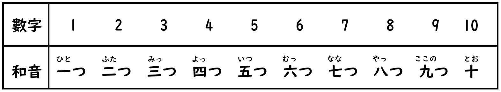
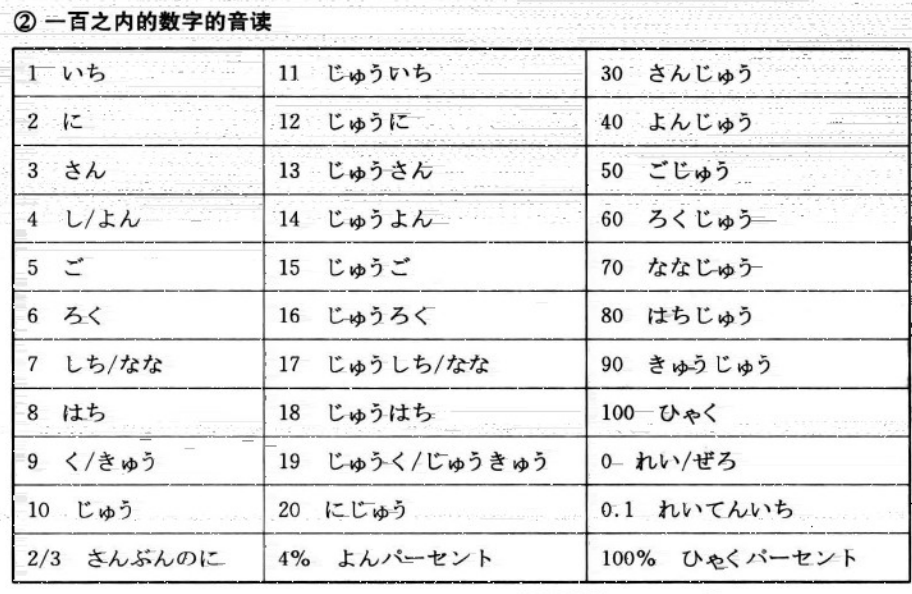
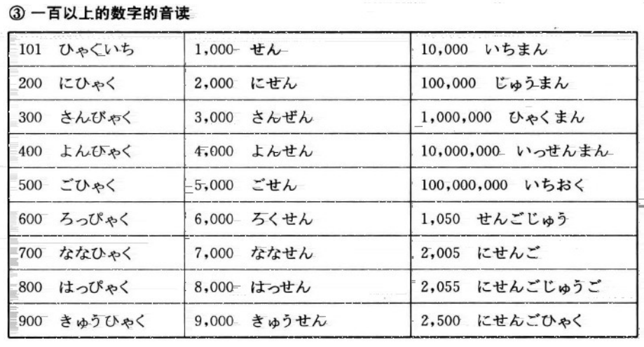

# 量词

## 一：基数词

为单纯用以计数的单词，表事物的具体数量

1.  十以下数字的训读读法（无规律，只能记忆）
    
    
    

1. 一百以内的数字的音读读法
    
    
    

1. 一百以上数字的音读读法
    
    
    

## 二：序数词

为表示**事物顺序**的数词。

- 例子
    1. 第一（**だい**いち）～**課、回、行目**など【**第**一**课**/**第**一**次**/**第一行**等】
    2. 一番（いち**ばん**）【1**号**】
    3. 一つ目（ひとつ**め**）【第一**个**】

## 三：助数词

为表示**事物计量名称**的数词

### 1. ~**個（こ）**

中文翻译为“个”，在中文当中这个数量词用途广泛。在日语中也一样，但有细微差别。

**用途**：用于比较立体（非扁平，非细长）的**小东西**

疑问：何個（なんこ）

- 可以被用到的部分物体
    - 文房具（消しゴム、クリップなど）
    - 办公用品（橡皮擦、回形针等）
    - 果物（りんご、オレンジ、メロン、いちごなど）
    - 水果（苹果、橘子、哈密瓜、草莓等）
    - 円い物（石、卵、飴、コインなど）
    - 圆东西（石头、蛋、糖、硬币等）
    - 飾り物（宝石、ピアス、リングなど）
    - 装饰物（宝石、耳环、项链等）
    - 台風、星、箱等々。
    - 台风、星星、箱子等。
- 读音（读音与数字音读相近，部分读音存在特殊读法）
    - **一**個
        
        **いっ**こ
        
    - 二個
        
        にこ
        
    - 三個
        
        さんこ
        
    - 四個
        
        よんこ
        
    - 五個
        
        ごこ
        
    - **六**個
        
        **ろっ**こ
        
    - 七個
        
        ななこ
        
    - **八**個
        
        **はっ**こ
        
    - 九個
        
        きゅうこ
        
    - **十**個
        
        **じ(ゅ)っ**こ
        
    

### 2. ~つ

与上面的“個（こ）”相同，意思均为“个”。

**用途**：广泛用于计算形状**非扁平、非细长状的物体**，比上面提到的「個」更大一些的东西。特别是立体的物体，以及抽象事物。

疑问：いくつ

- 区别
    
    ①「個」较**偏向口语**会话用法，而「つ」也**可用在正式场合**；
    
    ②「つ」可用于抽象的事物上（例：影子、想法等）；
    
    ③「つ」只能进行个位数计算；十以上的话直接用数字。
    
- 读法（十以下包括十均为数字的训读读法，无规律，只能记忆）
    - 一つ
        
        ひとつ
        
    - 二つ
        
        ふたつ
        
    - 三つ
        
        みっつ
        
    - 四つ
        
        よっつ
        
    - 五つ
        
        いつつ
        
    - 六つ
        
        むっつ
        
    - 七つ
        
        ななつ
        
    - 八つ
        
        やっつ
        
    - 九つ
        
        ここのつ
        
    - 十
        
        とお
        

### 3. ~**本（ほん）**

与中文当中用于计算书本的“本”不同，在日语中“本（ほん）”是用于计算**形状呈现细长状的物体**。

**用途**：形状呈现细长状的**物体**。

疑问词：何本（なんぼん）

- 可以用到的部分物体
    
    鉛筆、傘、野菜、纽、剣、樹木、ビール、桥、タワー、高層ビル、トンネ儿等々（铅笔、伞、蔬菜、纽扣、剑、树、大楼、桥、塔、高楼、隧道等）
    
- 读法（基本为数字的音读读法，部分读法有所区别）
    - **一**本
        
        **いっ**ぽん
        
    - 二本
        
        にほん
        
    - 三本
        
        さんぼん
        
    - 四本
        
        よんほん
        
    - 五本
        
        ごほん
        
    - **六**本
        
        **ろっ**ぽん
        
    - 七本
        
        ななほん
        
    - **八**本
        
        **はっ**ぽん
        
    - 九本
        
        きゅうほん
        
    - 十本
        
        **じ(ゅ)っ**ぽん
        

### 4. ~**枚（まい）**

引用资料

1. [【转载】吐血整理：这大概是最全面的日语量词总结了！]([https://www.bilibili.com/read/cv19804438/](https://www.bilibili.com/read/cv19804438/))
2. [【转载】吐血整理：这大概是最全面的日语量词总结了！【互联网档案馆】]([https://web.archive.org/web/20241226085047/https://www.bilibili.com/opus/728836245004746757](https://web.archive.org/web/20241226085047/https://www.bilibili.com/opus/728836245004746757))
3. [羽的日文（怎么念？）]([https://m.ximalaya.com/ask/q2769794](https://m.ximalaya.com/ask/q2769794))
4. [羽的日文（怎么念？）【互联网档案馆】]([https://web.archive.org/web/20241226084659/https://m.ximalaya.com/ask/q2769794](https://web.archive.org/web/20241226084659/https://m.ximalaya.com/ask/q2769794))
5. [N5日文單字01（名詞）數字與時間（超詳細）]([https://www.sigure.tw/learn-japanese/vocabulary/n5/01#什麼是訓讀（和音）？](https://www.sigure.tw/learn-japanese/vocabulary/n5/01#%E4%BB%80%E9%BA%BC%E6%98%AF%E8%A8%93%E8%AE%80%EF%BC%88%E5%92%8C%E9%9F%B3%EF%BC%89%EF%BC%9F))
6. [N5日文單字01（名詞）數字與時間（超詳細）【互联网档案馆】]([https://web.archive.org/web/20241226090239/http://web.archive.org/screenshot/https://www.sigure.tw/learn-japanese/vocabulary/n5/01#expand](https://web.archive.org/web/20241226090239/http://web.archive.org/screenshot/https://www.sigure.tw/learn-japanese/vocabulary/n5/01#expand))