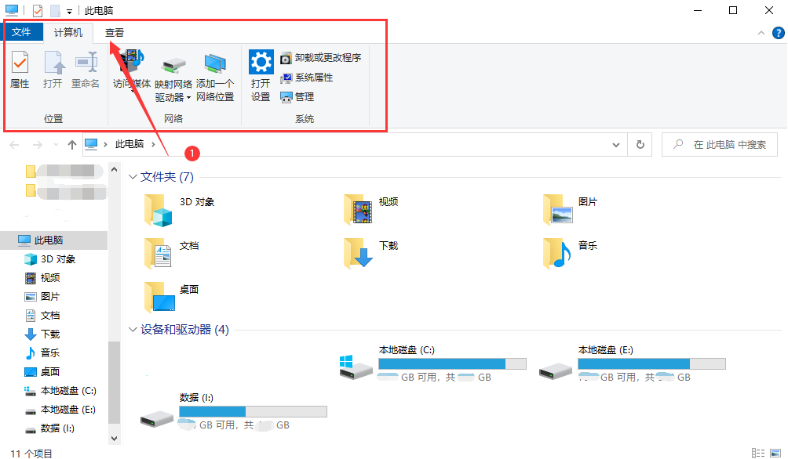
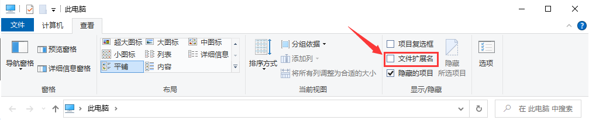
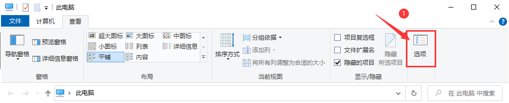
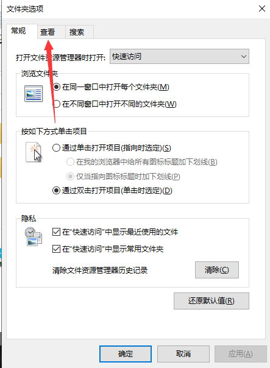

# 2. 文件扩展名

在无论哪一个系统上，每个文件基本会有其代表特定功能的扩展名。

!!! note 例如
    1. 文本扩展名：.txt、.pdf、.docx 等
    2. 音频扩展名：.mp3、.wav、.ogg、.flac 等
    3. 视频扩展名：.mp4、.flv、.m3u8 等

ps: 在 windows 操作系统上，文件管理器是默认 **隐藏已知文件类型的扩展名** 的，我们的推荐是将其取消隐藏

- 以 win10 系统为例子：
    
此电脑—>查看—>文件扩展名 将其勾选上
    



        
或着

- 此电脑/计算机 —> 查看/组织 —> 选项/文件夹和搜索选项 —> 查看 —> 隐藏已知文件类型的扩展名 取消勾选后点击确定即可



    

    


……

~~当然，我们没有忘记这是 c# 的课程。~~

我们可以新创建一个文本文件（.txt），并修改它的文件扩展名为 `.cs` （C Sharp 的缩写、c#的源代码文件）。

假设我新创建了一个文本文件为 `newCSharp.txt` 将其修改扩展名为 `newCSharp.cs` 并打开：

newCSharp.cs

```csharp
// 在此处我们就可以编写 C# 的代码了

// 举个例子，先不用看懂
using System;

namespace MySpace
{
    class Program
    {
        static void Main(string[] args)
        {
            Console.WriteLine("Hello World!"); // 会向控制台输出“Hello World!”
            Console.ReadKey();
        }
    }
}
```

~~ps: 微软总是喜欢开发新的语言去尝试替代别人的语言，无论是 C# 对标 Java 也好、Jscript 对标当时的 JavaScript 也好（）~~

其在编译后输出的可执行文件（例如：.exe）进行执行后便会弹出 `Hello World!` 字样了，而这便是我们开始编写的第一个可执行代码。


---
参考资料：

[**【C#零基础入门教程 Visual Studio 2022】人生低谷来学C# P5：C#代码结构**](https://www.bilibili.com/video/BV1NA4y1R7vL/?p=5)