# 4.Visual Studio

## 一：下载

为了方便我们调试 C# 程序，通常会借助一些工具来编写、运行、调试代码。

市场上的编程工具琳琅满目，有些什么好选择吗？

咱这边就拿微软自家的 IDE  为例子吧

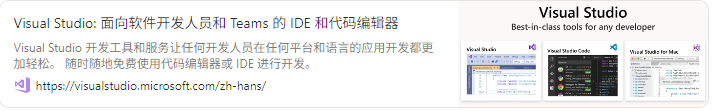
[Visual Studio: 面向软件开发人员和 Teams 的 IDE 和代码编辑器](https://visualstudio.microsoft.com/zh-hans/)

可以直接点击下面的链接来跳转到下载页面

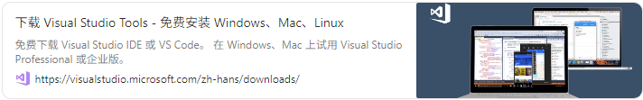
[下载 Visual Studio Tools - 免费安装 Windows、Mac、Linux](https://visualstudio.microsoft.com/zh-hans/downloads/)

- 它分为三个版本
    1. 社区版[Community]（此次演示使用的版本）：对学生、开源贡献者和个人免费
    2. 专业版[Professional]：适合小型团队
    3. 企业版[Enterprise]：适用于任何规模的团队

## 二：安装

打开我们刚才下载到的 VS 安装器，会弹出一个小窗口，点击**继续：**

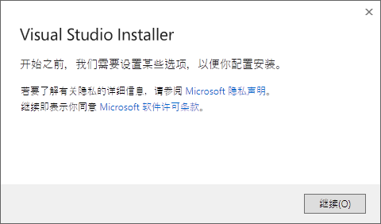

等待其准备完成：

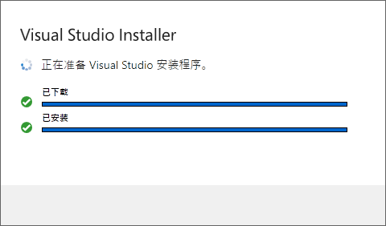

此时会进入到一个安装界面

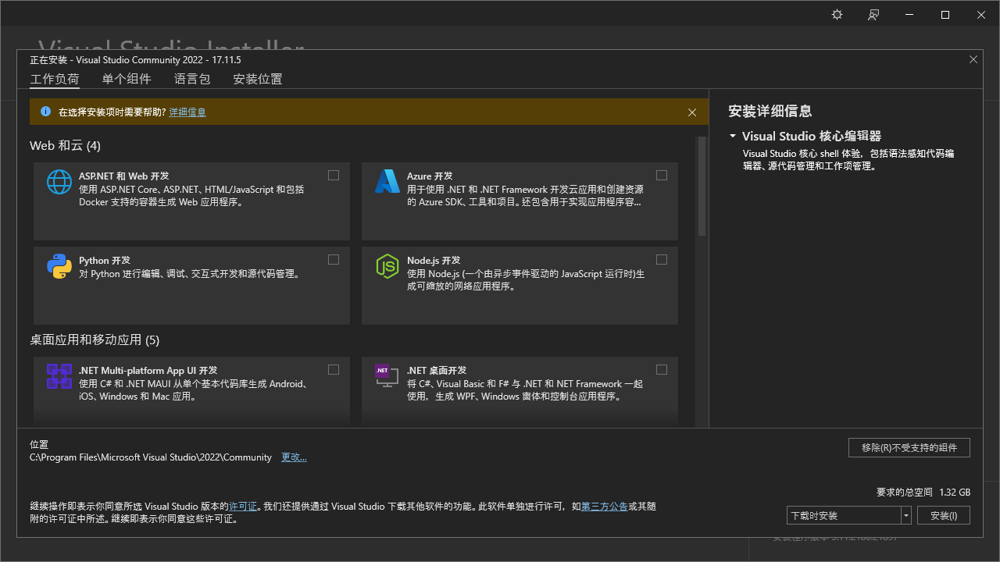

ps：安装的位置可以调整一次，下次调整需要重新安装。

由于我们需要进行 C# 的开发，因此我们选择 桌面应用和移动应用 —> .NET 桌面开发。

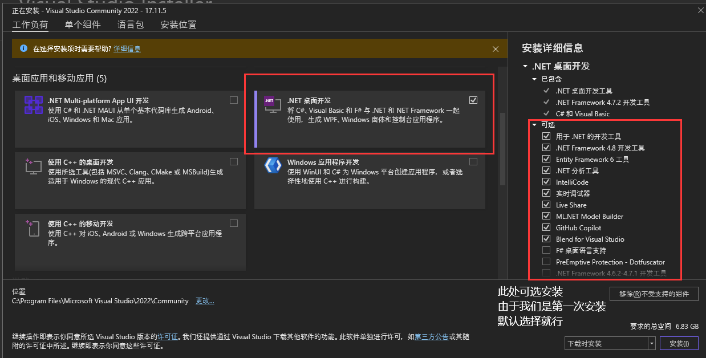

接下来点击安装

点击后需要等待较长的时间，耐心等待（预计需要等待半个小时左右，跟配置和网络情况有关）

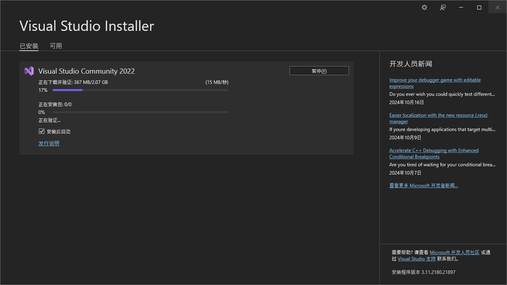

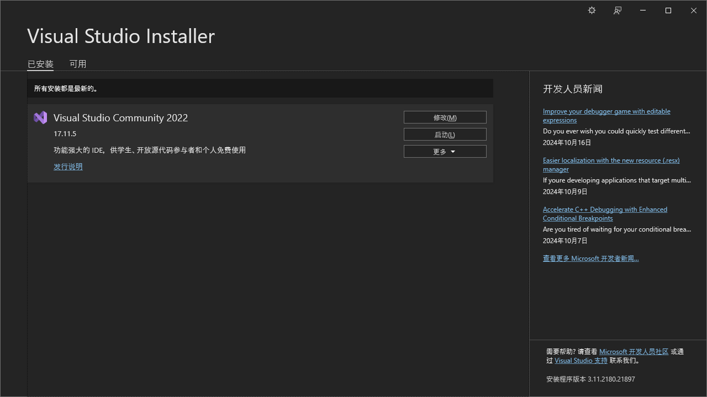

## 三：启动

我们此时会看到一个新的界面弹出，点击“暂时跳过此项”即可

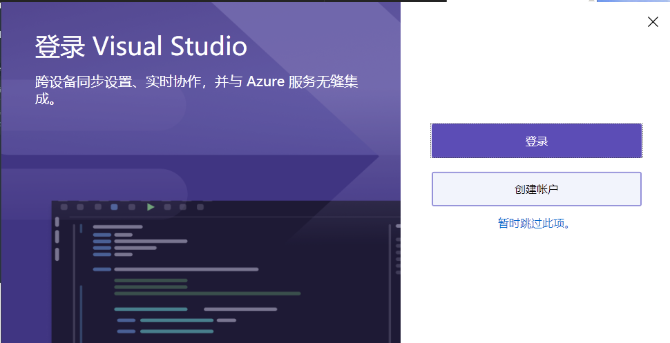

此处会要求我们设置需要进行开发的语言和主题，一般默认即可。选择好后可以点击启动了。

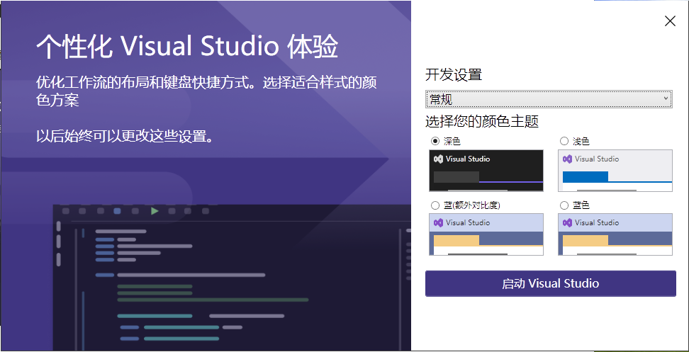

此处会进入到项目管理的界面，由于是第一次使用，所以是没有任何内容的

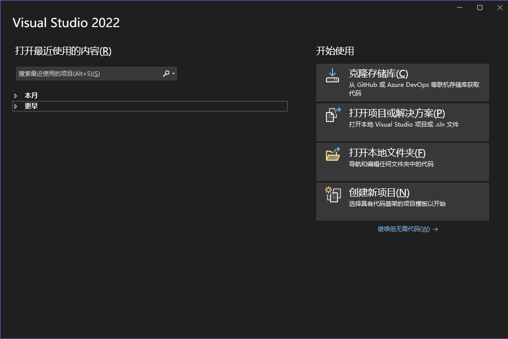

## 四：项目管理

此时点击“创建新项目”

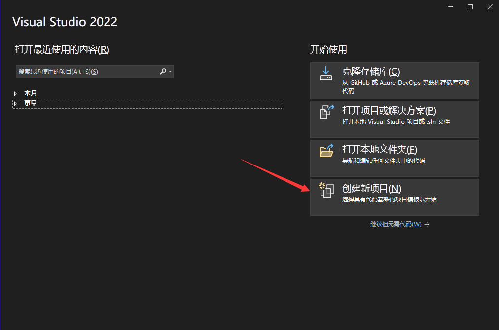

打开了项目模版列表，向下拉选择“控制台应用（.NET Framework）”，选择后点击“下一步”

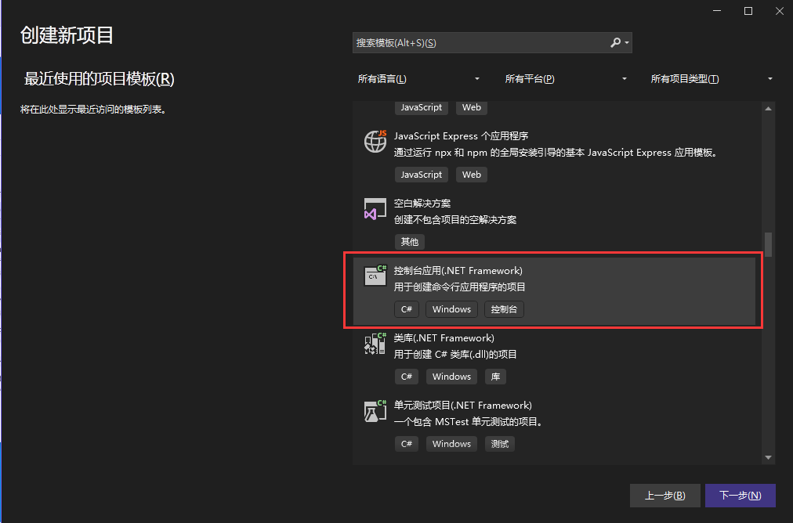

此时会让我们设置名称，可以随意修改项目名称，这里咱选择的是默认名称：

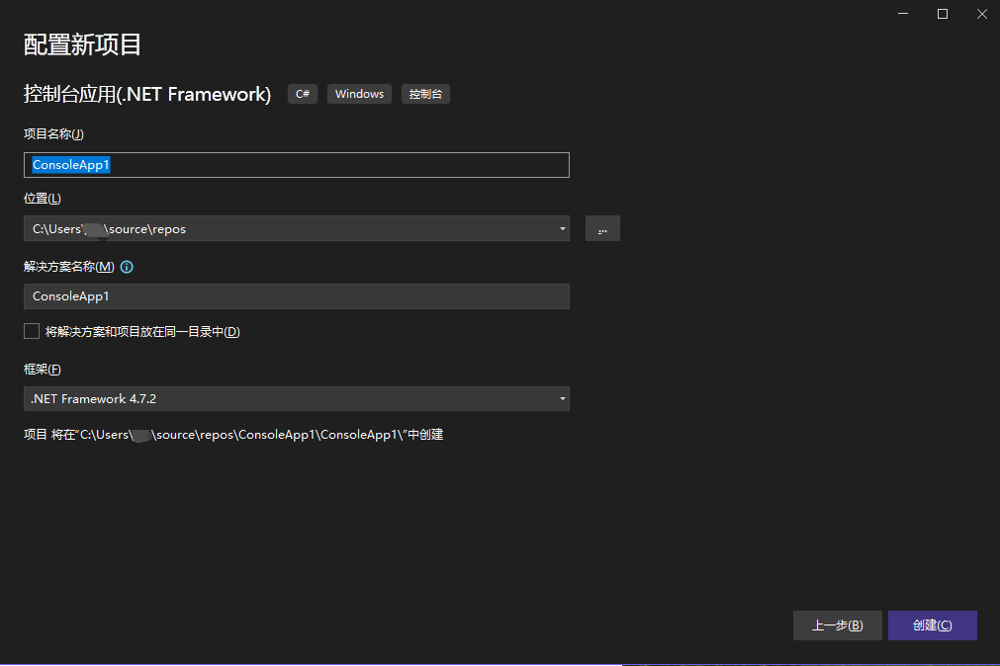

等待过后，便能够进入到真正的代码编辑、调试页面了

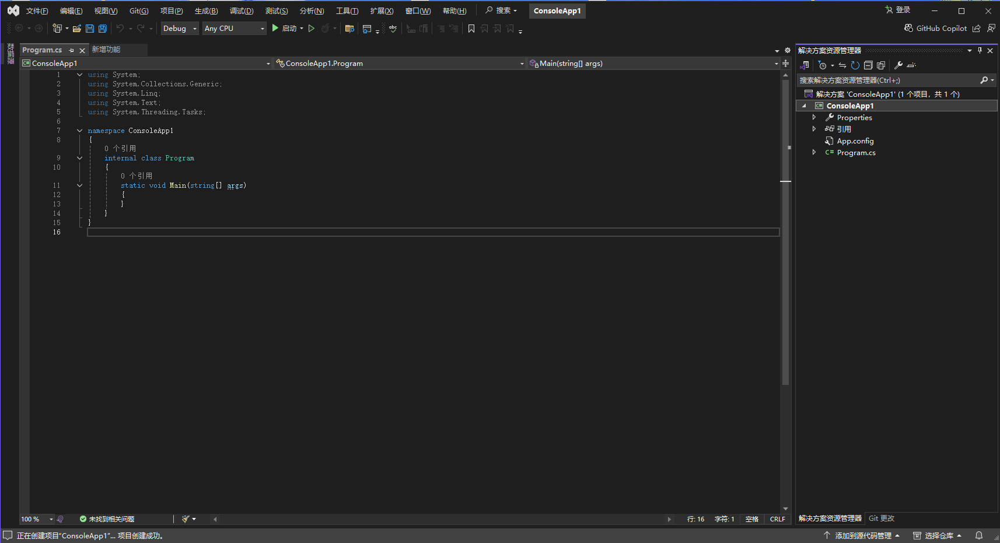

可以看到，它帮我们默认创建好了项目文件“Program.cs”并自动写好了所需要的基本框架。

将前些课程中的第一个 C# 程序搬运过来试试

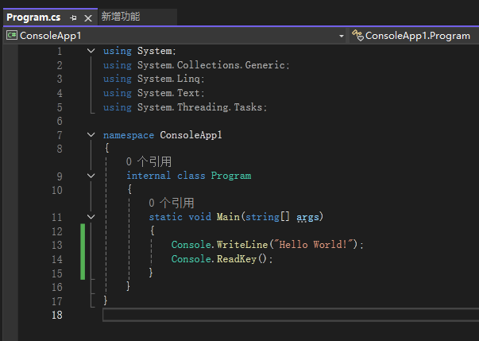

点击上面的“启动”按钮

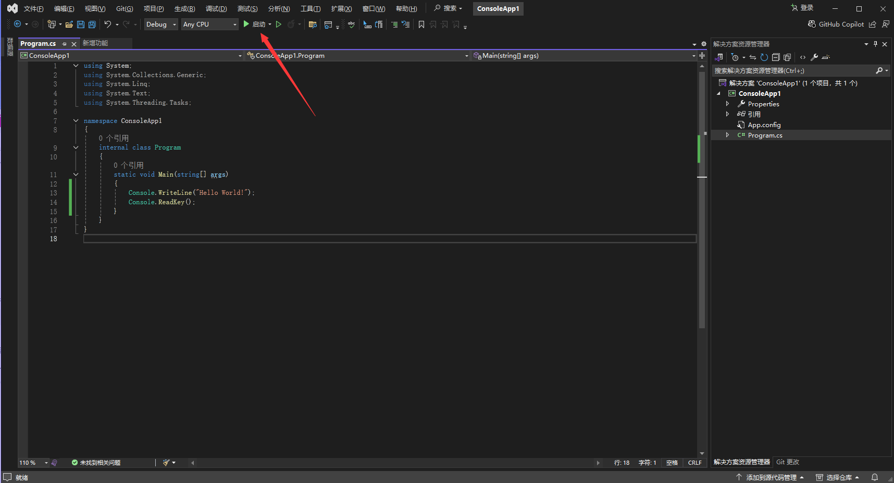

就会自动帮我们进行代码的编译操作并启动我们编辑的程序，成功在控制台上输出了“Hello World!”：

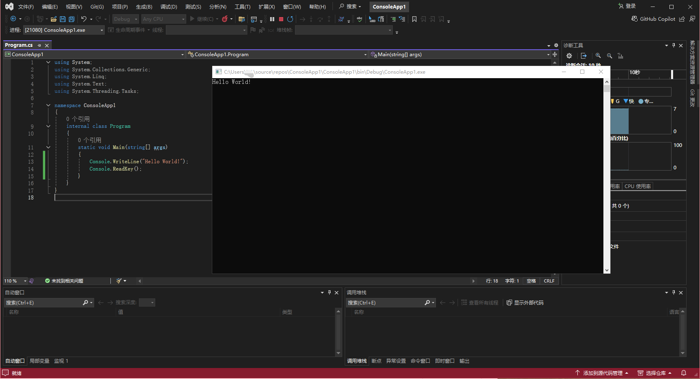

点击任意键或点击叉号结束。