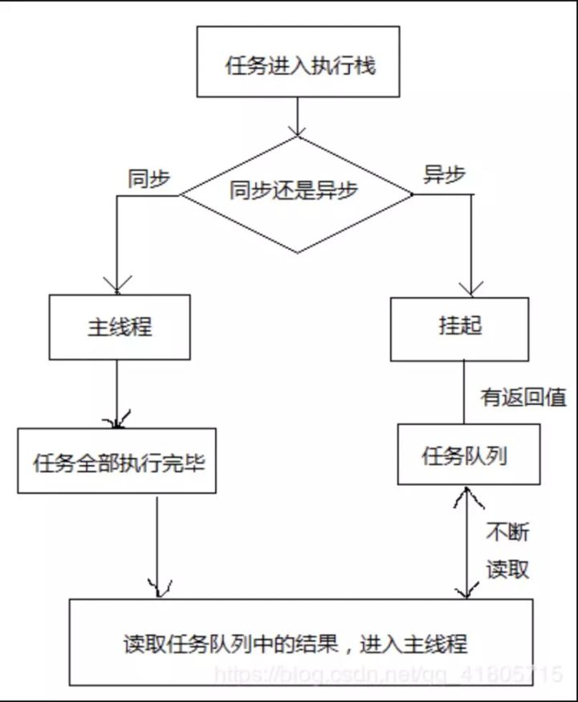
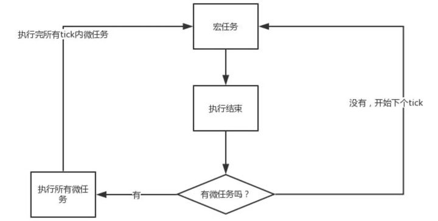

# 了解JS异步
# 一：为什么需要异步
js语言设计之初就是一个在浏览器当中运行的<font color=red>单线程脚本语言</font>。

正是因为js为单线程，因此在同一时间内只能做一件事。
```javascript
function fun(a) {
    console.log(a);
}
function STO(a, b) {
    setTimeout(() => { 
        fun(a);
    }, b);
}
STO(1, 500);
STO(2, 2000);
STO(3, 3500);
// 输出1：等待了500ms
// 输出2：等待了2000ms
// 输出3：等待了3500ms
```

但是遇到等待（网络请求、定时任务）就会卡住，卡住的时候CPU就是空闲的，这种等待让人不甘心。
```javascript
console.log(1)
alert(2)        // 页面会在这一行卡住
console.log(3)
```

而异步不会阻塞代码的执行，所以页面就不会卡住，因此使用异步能够让页面能够持续加载。
```javascript
let slV: number = 0,
    clearslV = setInterval(() => {
        if (slV >= 1) {
            clearInterval(clearslV);
        };
        console.log(slV);
        slV++;
    }, 1000);
console.log("start");
console.log("end");
// start
// end
// 0
// 1
```

**如果JS中不存在异步，代码则只能自上而下执行，如果上一行解析时间很长，那么下面的代码就会被阻塞。**
对于用户而言,阻塞就意味着"卡死"，这样就导致了很差的用户体验，所以，JS中存在异步执行。

---
## 二：如何实现异步？
通过 **事件循环（event loop）** 实现“异步”。

---
## 三：详细讲解事件循环（event loop）
<font color=red size=4>注：此处主要围绕浏览器当中的事件循环。</font>

### **1.浏览器的执行线程**
>在解释事件循环之前首先先解释一下浏览器的执行线程：
>浏览器是<font color=red>多进程</font>的，浏览器每一个域名（主体）共享一个渲染进程，其中浏览器渲染进程（浏览器内核）属于浏览器多进程中的一种，主要负责页面渲染，脚本执行，事件处理等。

>其包含的线程有：<font color=bluesky>
> 1. GUI 渲染线程（负责渲染页面，解析 HTML，CSS 构成 DOM 树）；
> 2. JS 引擎线程；
> 3. 事件触发线程；
> 4. 定时器触发线程；
> 5. http 请求线程等主要线程。</font>

### **2.执行中的线程**
> * **主线程**：也就是 js 引擎执行的线程，这个线程只有一个，页面渲染、函数处理都在这个主线程上执行。
> * **工作线程**：也称幕后线程，这个线程可能存在于浏览器或js引擎内，与主线程是分开的，处理文件读取、网络请求等异步事件。

### **3.任务队列（Event Queue）**
>所有的任务可以分为<font color=red>同步任务</font>和<font color=red>异步任务</font>。
> 1. **同步任务**，顾名思义，就是立即执行的任务，同步任务一般会直接进入到主线程中执行；
> 2. **异步任务**，就是异步执行的任务，比如ajax网络请求，setTimeout 定时函数等都属于异步任务，异步任务会通过任务队列的机制（先进先出）来进行协调。


同步和异步任务分别进入不同的执行环境，同步的进入主线程，即主执行栈，异步的进入任务队列。

主线程内的任务执行完毕为空，会去任务队列读取对应的任务，推入主线程执行。

**上述过程的不断重复**就是我们说的 Event Loop（事件循环）。

---
在事件循环中，每进行一次循环操作称为**tick**。代码从头执行至尾就叫一个tick。

每一次 tick 的任务处理模型是比较复杂的，其关键的步骤可以总结如下：
> 1. 在此次 tick 中选择最先进入队列的任务（oldest task），如果有则执行（一次）；
> 2. 检查是否存在 微任务（Microtasks） ，如果存在则不停地执行，直至清空 微任务队列（Microtask Queue）；
> 3. 更新、渲染（render）；
> 4. 主线程重复执行上述步骤。


### **4.什么是 microtasks ？**
> task分为两大类：
> 1. Macro Task （宏任务）；
> 2. Micro Task（微任务）。

**每个宏任务结束后, 都要清空所有的微任务**。
而这里的 Macro Task 也是我们常说的 task 。

### **5.了解宏任务、微任务**
宏任务主要有：
> * script（整体代码）；
> * setTimeout；
> * setInterval；
> * I/O；
> * UI 交互事件；
> * setImmediate（Node.js 环境）。

微任务主要有：
> * Promise；
> * MutaionObserver；
> * process.nextTick（Node.js 环境）。

### **6.执行优先级**
正因为js是单线程，所以所有主线程的<font color=red>宏任务先执行，后优先执行微任务队列，最后执行宏任务队列</font>，秉承先进先出的原则。
> 为何是宏任务先于微任务执行：
>
>第一轮事件循环中，最先开始检查宏队列有无，无则该轮不执行宏任务，因为同步代码还没执行，所以就算写了宏任务也只会在第二轮检查出并执行，进而因为微任务的该轮全部执行的特点使得第一轮事件循环中**看起来是微任务先比宏任务执行**，但是从第二轮开始就宏任务先执行，而且微任务的创建也几乎只能从宏任务中来，因为第一轮同步代码都基本执行完了。

---
## 四：补充
### 1.“setTimeout()”第二参数的数值最小值问题
有时我们会设置“setTimeout()”第二参数的数值为0，但这样的数值很容易让人认为会立即执行里面的回调函数。
```javascript
setTimeout(()=>{
    console.log(1);
},0);
// 等同于？
(function(){
    console.log(1);
})();
```

HTML5标准规定了setTimeout()的<font color=red>第二个参数的最小值（最短间隔），不得低于4毫秒，如果低于这个值，就会自动增加</font>。

这也说明，当我们设置“setTimeout()”第二参数的数值为4ms以下时，解析代码的时候会自动添加第二参数的数值，以解决最小值争议问题。
```javascript
console.log(1);
setTimeout(()=>{
    console.log(2);
},0);
console.log(3);
// 1
// 3
// 2
```